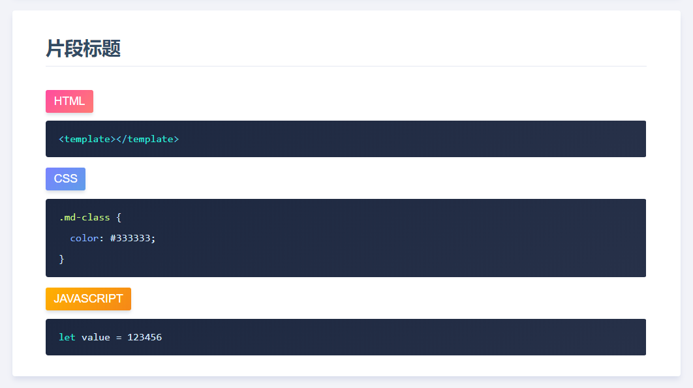
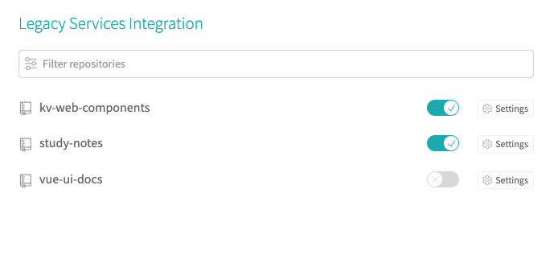
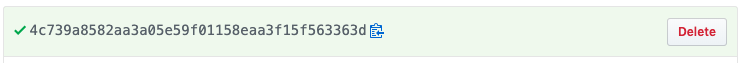
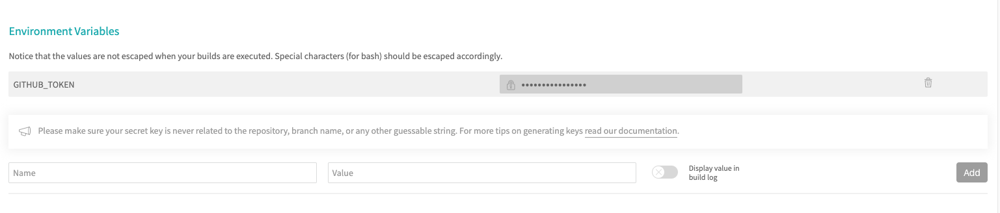
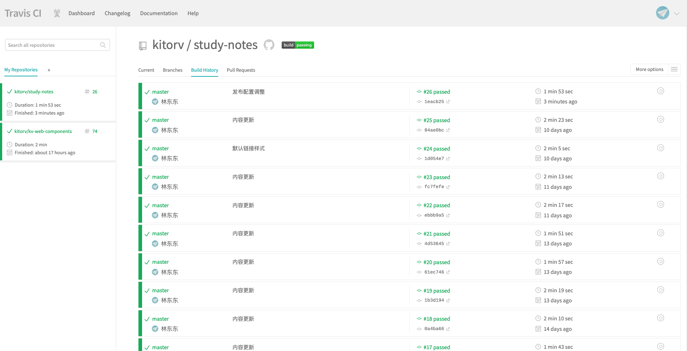

# Vue+Markdown 编译静态网站

## 在线效果展示

[https://kitorv.github.io/study-notes](https://kitorv.github.io/study-notes/)

基于 vue 搭建笔记内容使用`markdown`文件编写，自动编译成网站

## 更新日志

版本更新详细说明 [CHANGELOG](/CHANGELOG.md)

## 运行环境搭建

### Node 下载安装

[Node 下载](http://nodejs.cn/download)

### 包管理器

> `node`自带的`npm`部分文件可能不能下载或者比较慢建议安装`cnpm`

```bash
npm install -g cnpm --registry=https://registry.npm.taobao.org
```

### 安装 Vue 环境

```bash
npm install -g @vue/cli
```

### 安装依赖

切换到代码根目录

```bash
cd 代码目录
```

安装依赖

```bash
npm install
# OR
cnpm install
```

运行项目，浏览器访问

```bash
npm run serve
# OR
vue ui
```

打包发布

```bash
npm run build
```

## 文档编写

`markdown`文件编写,用`:::snippet`和`:::`包裹内容

````md
:::snippet 片段标题

```html
<template></template>
```

```css
.md-class {
  color: #333333;
}
```

```javascript
let value = 123456;
```

:::
````

## 自动编译成效果



## `setting.json`文件配置

| 属性 | 必填 | 描述                                    |
| :--- | :--- | :-------------------------------------- |
| name | ⭕   | 生成菜单标题或者分组标题                |
| url  | ❌   | markdown 的文件路径，不配置生成分组标题 |

> `@`默认`src`目录

```javascript
{
  "routes": [
    { "path": "", "name": "JavaScript基础" },
    {
      "path": "@/notes/javascript/JAVASCRIPT-01.md",
      "name": "简介和使用"
    }
  ]
}
```

## 部署配置

### 1. 通用打包服务器部署

```bash
npm run build
```

打包后`dist`文件夹内容直接发布到服务器

### 2. 静态预渲染服务器部署

```bash
npm run prerender
```

打包后`dist`文件夹内容直接发布到服务器

### 3. travis 自动构建 github-pages 在线访问

- github 账号登陆 [https://www.travis-ci.org](https://www.travis-ci.org),开启项目自动构建 `study-notes`



- github 生成 Token [https://github.com/settings/tokens](https://github.com/settings/tokens),勾线`repo` 生成 token


- 复制生成的 token



- travis 进入 `Settings` 配置环境变量 GITHUB_TOKEN 将 github 生成的 token 添加进去



- travis 配置在项目下的`.travis.yml`，具体更多配置查看 [https://docs.travis-ci.com](https://docs.travis-ci.com)

```yml
#项目构建环境Node
language: node_js

# Node版本 10
node_js:
  - "10"

# 依赖安装
install:
  - npm install

# 代码打包
script:
  - npm run build

# 发布到gh-pages
deploy:
  provider: pages
  email: 826526881@qq.com
  name: kitorv
  local_dir: dist
  skip_cleanup: true
  github_token: $GITHUB_TOKEN
  keep_history: true
  on:
    branch: master
```

- 提交代码，查看构建状态 [https://www.travis-ci.org/kitorv/study-notes/builds](https://www.travis-ci.org/kitorv/study-notes/builds)



- 构建完成，访问 `gh-page` 地址：[https://kitorv.github.io/study-notes](https://kitorv.github.io/study-notes)


