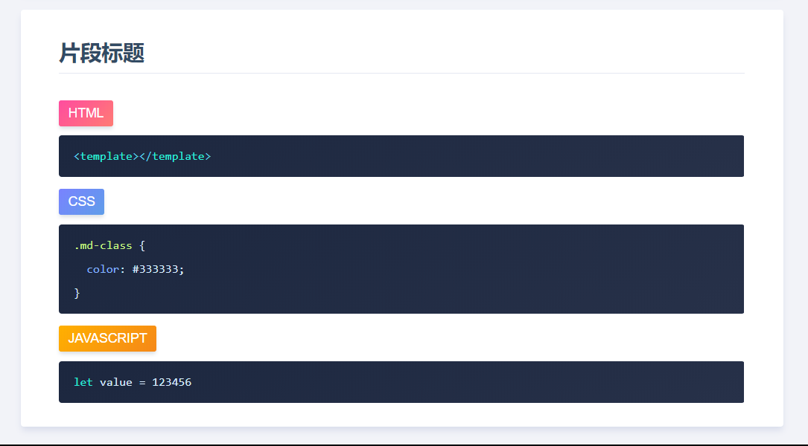

# Vue+Markdown 编译静态网站

## 在线效果展示

[https://kitorv.github.io/study-notes](https://kitorv.github.io/study-notes/)

基于 vue 搭建笔记内容使用`markdown`文件编写，自动编译成网站

## 更新日志

版本更新详细说明 [CHANGELOG](/CHANGELOG.md)

## 运行环境搭建

### Node 下载安装

[Node 下载](http://nodejs.cn/download)

### 包管理器

> `node`自带的`npm`部分文件可能不能下载或者比较慢建议安装`cnpm`

```bash
npm install -g cnpm --registry=https://registry.npm.taobao.org
```

### 安装 Vue 环境

```bash
npm install -g @vue/cli
```

### 安装依赖

切换到代码根目录

```bash
cd 代码目录
```

安装依赖

```bash
npm install
# OR
cnpm install
```

运行项目，浏览器访问

```bash
npm run serve
# OR
vue ui
```

打包发布

```bash
npm run build
```

## 文档编写

`markdown`文件编写,用`:::snippet`和`:::`包裹内容

````md
:::snippet 片段标题

```html
<template></template>
```

```css
.md-class {
  color: #333333;
}
```

```javascript
let value = 123456;
```

:::
````

## 自动编译成效果



## `setting.json`文件配置

- `url`：非必填，markdown 的文件路径，不配置生成分组标题
- `name`：必填，生成菜单标题或者分组标题
- `@`默认`src`目录

```javascript
{
  "routes": [
    { "path": "", "name": "JavaScript基础" },
    {
      "path": "@/notes/javascript/JAVASCRIPT-01.md",
      "name": "简介和使用",
      "date": "2018-12-09"
    }
  ]
}
```

## 部署配置

### 1. 通用打包服务器部署

```bash
npm run build
```

打包后`dest`文件夹内容直接发布到服务器

### 2. 静态预渲染服务器部署

```bash
npm run prerender
```

打包后`dest`文件夹内容直接发布到服务器

### 3. 在线 github 访问部署

```bash
npm run docs
```

- 打包生成文件夹`docs`
- `docs`文件夹提交推送到 github
- github 项目的`setting`配置=>`GitHub Pages`选择`master branch/docs folder`
- 保存配置生成访问地址，直接访问
- 访问项目如果不存在，对应修改`vue.config.js`的`baseUrl`与当前路径匹配
- 部署配置完成访问 [https://kitorv.github.io/study-notes](https://kitorv.github.io/study-notes/)
