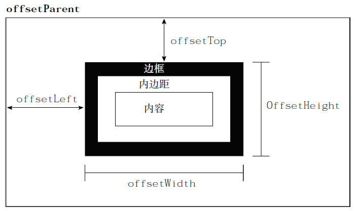
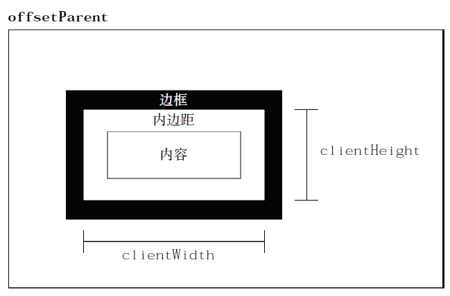
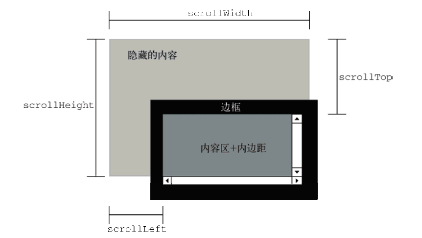
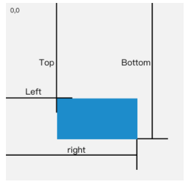

:::snippet DOM 变化

1. `XML` 命名空间。

```html
<html xmlns="http://www.w3.org/1999/xhtml">
  <head>
    <title>Example XHTML page</title>
  </head>
  <body>
    <svg
      xmlns="http://www.w3.org/2000/svg"
      version="1.1"
      viewBox="0 0 100 100"
      style="width:100%; height:100%"
    >
      <rect x="0" y="0" width="100" height="100" style="fill:red" />
    </svg>
  </body>
</html>
```

2. 针对命名空间也提供了各种指定命名空间对应的方法。

```javascript
//创建一个新的SVG 元素
var svg = document.createElementNS("http://www.w3.org/2000/svg", "svg");
//创建一个属于某个命名空间的新特性
var att = document.createAttributeNS("http://www.somewhere.com", "random");
//取得所有XHTML 元素
var elems = document.getElementsByTagNameNS(
  "http://www.w3.org/1999/xhtml",
  "*"
);
```

:::

:::snippet 元素样式

1. `style` 属性操作和获取样式。

```javascript
var myDiv = document.getElementById("myDiv");
//设置背景颜色
myDiv.style.backgroundColor = "red";
//改变大小
myDiv.style.width = "100px";
myDiv.style.height = "200px";
//指定边框
myDiv.style.border = "1px solid black";

alert(myDiv.style.backgroundColor); //"red"
alert(myDiv.style.width); //"100px"
alert(myDiv.style.height); //"200px"
```

2. 获取元素的所有样式。

```javascript
function getStyleCss() {
  if (window.getComputedStyle) {
    return window.getComputedStyle(ele, null);
  }
  return ele.currentStyle;
}
```

3. 操作样式表，获取样式表根据提供的属性对样式表进行设置。

```javascript
function getStyleSheet(element) {
  return element.sheet || element.styleSheet;
}
//取得第一个<link/>元素引入的样式表
var link = document.getElementsByTagName("link")[0];
var sheet = getStylesheet(link);
```

4. `css` 规则：设置 `css` 解析取值等规则实际开发几乎不会用

:::

:::snippet 元素偏移量

1. `offsetHeight` ：元素在垂直方向上占用的空间大小，以像素计。包括元素的高度、（可见的）水平滚动条的高度、上边框高度和下边框高度。
2. `offsetWidth` ：元素在水平方向上占用的空间大小，以像素计。包括元素的宽度、（可见的）垂直滚动条的宽度、左边框宽度和右边框宽度。
3. `offsetLeft` ：元素的左外边框至包含元素的左内边框之间的像素距离。
4. `offsetTop` ：元素的上外边框至包含元素的上内边框之间的像素距离。



:::

:::snippet 客户区大小

```javascript
function getViewport() {
  if (document.compatMode == "BackCompat") {
    return {
      width: document.body.clientWidth,
      height: document.body.clientHeight
    };
  } else {
    return {
      width: document.documentElement.clientWidth,
      height: document.documentElement.clientHeight
    };
  }
}
```



:::

:::snippet 滚动大小

1. `scrollHeight` ：在没有滚动条的情况下，元素内容的总高度。
2. `scrollWidth` ：在没有滚动条的情况下，元素内容的总宽度。
3. `scrollLeft` ：被隐藏在内容区域左侧的像素数。通过设置这个属性可以改变元素的滚动位置。
4. `scrollTop` ：被隐藏在内容区域上方的像素数。通过设置这个属性可以改变元素的滚动位置。



```javascript
var docHeight = Math.max(
  document.documentElement.scrollHeight,
  document.documentElement.clientHeight
);
var docWidth = Math.max(
  document.documentElement.scrollWidth,
  document.documentElement.clientWidth
);
```

:::

:::snippet 确定元素大小

```javascript
function getBoundingClientRect(element) {
  if (typeof arguments.callee.offset != "number") {
    var scrollTop = document.documentElement.scrollTop;
    var temp = document.createElement("div");
    temp.style.cssText = "position:absolute;left:0;top:0;";
    document.body.appendChild(temp);
    arguments.callee.offset = -temp.getBoundingClientRect().top - scrollTop;
    document.body.removeChild(temp);
    temp = null;
  }
  var rect = element.getBoundingClientRect();
  var offset = arguments.callee.offset;
  return {
    left: rect.left + offset,
    right: rect.right + offset,
    top: rect.top + offset,
    bottom: rect.bottom + offset
  };
}
```



> IE、Firefox 3+、Safari 4+、Opera 9.5 及 Chrome 为每个元素都提供了一个 getBoundingClientRect()方法。
> 这个方法返回会一个矩形对象，包含 4 个属性：left、top、right 和 bottom。这些属性给出了元素在页面中相对于视口的位置。
> 但是，浏览器的实现稍有不同。IE8 及更早版本认为文档的左上角坐标是(2, 2)，而其他浏览器包括 IE9 则将传统的(0,0)作为起点坐标。

:::

:::snippet NodeIterator 遍历

1. `document.createNodeIterator()` 创建 `NodeIterator`

| 参数                     | 描述                                                                   |
| :----------------------- | :--------------------------------------------------------------------- |
| root                     | 想要作为搜索起点的树中的节点                                           |
| whatToShow               | 表示要访问哪些节点的数字代码                                           |
| filter                   | 是一个 NodeFilter 对象，或者一个表示应该接受还是拒绝某种特定节点的函数 |
| entityReferenceExpansion | 布尔值，HTML 页面中没有用，不能扩展                                    |

2. `whatToShow` 指定过滤类型的参数

| 类型                                                                         | 描述                                                  |
| :--------------------------------------------------------------------------- | :---------------------------------------------------- |
| NodeFilter.SHOW_ALL                                                          | 显示所有类型的节点                                    |
| NodeFilter.SHOW_ELEMENT                                                      | 显示元素节点                                          |
| NodeFilter.SHOW_ATTRIBUTE                                                    | 显示特性节点。由于 DOM 结构原因，实际上不能使用这个值 |
| NodeFilter.SHOW_TEXT                                                         | 显示文本节点                                          |
| NodeFilter.SHOW_CDATA_SECTION                                                | 显示 CDATA 节点。对 HTML 页面没有用                   |
| NodeFilter.SHOW_ENTITY_REFERENCE                                             | 显示实体引用节点。对 HTML 页面没有用                  |
| NodeFilter.SHOW_ENTITYE                                                      | 显示实体节点。对 HTML 页面没有用                      |
| NodeFilter.SHOW_PROCESSING_INSTRUCTION：显示处理指令节点。对 HTML 页面没有用 |
| NodeFilter.SHOW_COMMENT                                                      | 显示注释节点                                          |
| NodeFilter.SHOW_DOCUMENT                                                     | 显示文档节点                                          |
| NodeFilter.SHOW_DOCUMENT_TYPE                                                | 显示文档类型节点                                      |
| NodeFilter.SHOW_DOCUMENT_FRAGMENT                                            | 显示文档片段节点。对 HTML 页面没有用                  |
| NodeFilter.SHOW_NOTATION                                                     | 显示符号节点。对 HTML 页面没有用                      |

3. 过滤满足多个条件的节点。

```javascript
var whatToShow = NodeFilter.SHOW_ELEMENT | NodeFilter.SHOW_TEXT;
```

4. 遍历节点。

```javascript
var div = document.getElementById("div1");
var iterator = document.createNodeIterator(
  div,
  NodeFilter.SHOW_ELEMENT,
  null,
  false
);
var node = iterator.nextNode(); //上一个节点可以使用 previousNode()
while (node !== null) {
  alert(node.tagName); //输出标签名
  node = iterator.nextNode();
}
```

:::

:::snippet TreeWalker 遍历

1. `TreeWalker` 方法

| 方法              | 描述                           |
| :---------------- | :----------------------------- |
| nextNode()        | 遍历当前节点的下一个节点       |
| previousNode()    | 遍历当前节点的上一个节点       |
| parentNode()      | 遍历到当前节点的父节点         |
| firstChild()      | 遍历到当前节点的第一个子节点   |
| lastChild()       | 遍历到当前节点的最后一个子节点 |
| nextSibling()     | 遍历到当前节点的下一个同辈节点 |
| previousSibling() | 遍历到当前节点的上一个同辈节点 |

```javascript
var div = document.getElementById("div1");
var filter = function(node) {
  return node.tagName.toLowerCase() == "li"
    ? NodeFilter.FILTER_ACCEPT
    : NodeFilter.FILTER_SKIP;
};
var walker = document.createTreeWalker(
  div,
  NodeFilter.SHOW_ELEMENT,
  filter,
  false
);
var node = walker.nextNode();
while (node !== null) {
  alert(node.tagName); //输出标签名
  node = walker.nextNode();
}
```

2. `currentNode` 重新设置遍历的当前节点

```javascript
var node = walker.nextNode();
alert(node === walker.currentNode); //true
walker.currentNode = document.body; //修改起点
```

:::

:::snippet 范围

1. 范围是选择 `DOM` 结构中特定部分，然后再执行相应操作的一种手段。

2. 常用 `selectNode` 和 `selectNodeContents` 选中指定范围。

```javascript
var range1 = document.createRange();
range2 = document.createRange();
p1 = document.getElementById("p1");
range1.selectNode(p1);
range2.selectNodeContents(p1);
```

3. IE8 及更早版本不支持 `DOM2` 级遍历和范围”模块，但它提供了一个专有的文本范围对象，可
   以用来完成简单的基于文本的范围操作。IE9 完全支持 DOM 遍历。

4. 更多详细内容复杂操作参照对应的文档。

:::
