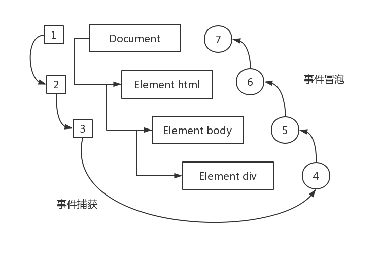

:::snippet 事件冒泡

1. IE 的事件流叫做事件冒泡(event bubbling)，即事件开始时由最具体的元素(文档中嵌套层次最深 的那个节点)接收，然后逐级向上传播到较为不具体的节点(文档)。
2. 如果你单击了页面中的`<div>`元素，那么这个 `click` 事件会按照如下顺序传播:

   `<div>` => `<body>` => `<html>` => `document`

```html
<!DOCTYPE html>
<html>
  <head>
    <title>Event Bubbling Example</title>
  </head>
  <body>
    <div id="myDiv">Click Me</div>
  </body>
</html>
```

> 现代浏览器都支持事件冒泡，但在具体实现上还是有一些差别。
> IE5.5 及更早版本中的事件冒 泡会跳过 `<html>` 元素(从 `<body>` 直接跳到 `document`)。
> IE9、Firefox、Chrome 和 Safari 则将事件一直 冒泡到 window 对象。

:::

:::snippet 事件捕获

事件捕获的思想 是不太具体的节点应该更早接收到事件，而最具体的节点应该最后接收到事件。
事件捕获的用意在于在 事件到达预定目标之前捕获它。

```html
<!DOCTYPE html>
<html>
  <head>
    <title>Event Bubbling Example</title>
  </head>
  <body>
    <div id="myDiv">Click Me</div>
  </body>
</html>
```

捕获顺序：`document` => `<html>` => `<body>` => `<div>`

> 事件捕获是 Netscape Communicator 唯一支持的事件流模型，但 IE9、Safari、Chrome、Opera 和 Firefox 目前也都支持这种事件流模型。
> 尽管“DOM2 级事件”规范要求事件应该从 `document` 对象 开始传播，但这些浏览器都是从 `window` 对象开始捕获事件的。
> 由于老版本的浏览器不支持，因此很少有人使用事件捕获。建议使用事件冒泡，在有特殊需要时再使用事件捕获。

:::

:::snippet DOM 事件流

DOM2 级事件”规定的事件流包括三个阶段:事件捕获阶段、处于目标阶段和事件冒泡阶段。



在 DOM 事件流中，实际的目标( `<div>` 元素)在捕获阶段不会接收到事件。这意味着在捕获阶段，事件从 `document` 到 `<html>` 再到 `<body>` 后就停止了。下一个阶段是“处于目标”阶段，于是事件在 `<div>` 上发生，并在事件处理中被看成冒泡阶段的一部分。然后，冒泡阶段发生， 事件又传播回文档。

> IE9、Opera、Firefox、Chrome 和 Safari 都支持 DOM 事件流;IE8 及更早版本不 支持 DOM 事件流。

:::

:::snippet HTML 事件处理程序

1. 标签事件设置。

```html
<input type="button" value="Click Me" onclick="alert('Clicked')" />
```

2. 方法事件设置。

```html
<input type="button" value="Click Me" onclick="showMessage()" />
```

```javascript
function showMessage() {
  alert("Hello world!");
}
```

3. `event` 事件对象。

```html
<!-- 输出 "Click" -->
<input type="button" value="Click" onclick="alert(event.value)" />
```

4. `html` 事件通过 `with` 扩展作用域。

```javascript
function(){
    with(document){
      with(this){
        //元素属性值
      }
    }
}
```

5. 表单作用域，实际内部就是设置 `with` 。

```html
<form method="post">
  <input type="text" name="username" value="" />
  <input type="button" value="Echo Username" onclick="alert(username.value)" />
</form>
```

:::

:::snippet DOM0 级事件处理程序

1. 每个元素(包括 `window` 和 `document`)都有自己的事件处理程序属性。

```javascript
var btn = document.getElementById("myBtn");
btn.onclick = function() {
  alert("Clicked");
};
```

2. DOM0 级方法指定的事件处理程序被认为是元素的方法，`this` 代表当前元素对象。

```javascript
var btn = document.getElementById("myBtn");
btn.onclick = function() {
  alert(this.id); //"myBtn"
};
```

3. 清除 DOM 0 级事件

```javascript
btn.onclick = null; //删除事件处理程序
```

:::

:::snippet DOM2 级事件处理程序

1. `addEventListener()` 事件绑定，绑定的事件会依次执行。

```javascript
var btn = document.getElementById("myBtn");
btn.addEventListener(
  "click",
  function() {
    alert(this.id);
  },
  false
);
btn.addEventListener(
  "click",
  function() {
    alert("Hello world!");
  },
  false
);
```

> 两个事件处理程序会按照添加它们的顺序触发，因此首先 会显示元素的 ID，其次会显示"Hello world!"消息

2. `removeEventListener()` 事件移除，移除参数与绑定的参数一致。

```javascript
var btn = document.getElementById("myBtn");
var handler = function() {
  alert(this.id);
};
btn.addEventListener("click", handler, false);
//这里省略了其他代码
btn.removeEventListener("click", handler, false);
```

3. 匿名函数绑定无法删除事件。

```javascript
var btn = document.getElementById("myBtn");
btn.addEventListener(
  "click",
  function() {
    alert(this.id);
  },
  false
);
//这里省略了其他代码
btn.removeEventListener(
  "click",
  function() {
    //没有用! alert(this.id);
  },
  false
);
```

> IE9、Firefox、Safari、Chrome 和 Opera 支持 DOM2 级事件处理程序。

:::

:::snippet IE 事件处理程序

1. `attachEvent()` 绑定事件。

```javascript
var btn = document.getElementById("myBtn");
btn.attachEvent("onclick", function() {
  alert("Clicked");
});
btn.attachEvent("onclick", function() {
  alert("Hello world!");
});
```

> `attachEvent()` 的第一个参数是`onclick`，而非 DOM 的 `addEventListener()`方法中的`click` 。

2. `detachEvent()` 删除绑定事件。

```javascript
var btn = document.getElementById("myBtn");
var handler = function() {
  alert("Clicked");
};
btn.attachEvent("onclick", handler);
//这里省略了其他代码
btn.detachEvent("onclick", handler);
```

> 支持 IE 事件处理程序的浏览器有 IE 和 Opera。

:::

:::snippet 跨浏览器的事件处理程序

通过客户端检测调用对应的方法处理事件绑定兼容浏览器差异。

```javascript
var EventUtil = {
  addHandler: function(element, type, handler) {
    if (element.addEventListener) {
      element.addEventListener(type, handler, false);
    } else if (element.attachEvent) {
      element.attachEvent("on" + type, handler);
    } else {
      element["on" + type] = handler;
    }
  },
  removeHandler: function(element, type, handler) {
    if (element.removeEventListener) {
      element.removeEventListener(type, handler, false);
    } else if (element.detachEvent) {
      element.detachEvent("on" + type, handler);
    } else {
      element["on" + type] = null;
    }
  }
};

var btn = document.getElementById("myBtn");
var handler = function() {
  alert("Clicked");
};
EventUtil.addHandler(btn, "click", handler); //这里省略了其他代码
EventUtil.removeHandler(btn, "click", handler);
```

:::

:::snippet DOM 中的事件对象

1. 事件绑定都会传入 `event` 对象。

```javascript
var btn = document.getElementById("myBtn");
btn.onclick = function(event){ alert(event.type); //"click"
    };
    btn.addEventListener("click", function(event){
alert(event.type); //"click" }, false);
```

2. event 属性和方法

| 属性/方法                  | 类型         | 描述                                                                                                    |
| :------------------------- | :----------- | :------------------------------------------------------------------------------------------------------ |
| bubbles                    | Boolean      | 表明事件是否冒泡                                                                                        |
| cancelable                 | Boolean      | 表明是否可以取消事件的默认行为                                                                          |
| currentTarget              | Element      | 其事件处理程序当前正在处理事件的那个元素                                                                |
| defaultPrevented           | Boolean      | 为 true 表 示 已 经 调 用 了 preventDefault() (DOM3 级事件中新增)                                       |
| detail                     | Integer      | 与事件相关的细节信息                                                                                    |
| eventPhase                 | Integer      | 调用事件处理程序的阶段:1 表示捕获阶段，2 表示“处于目标”，3 表示冒泡阶段                                 |
| preventDefault()           | Function     | 取消事件的默认行为。如果 cancelable 是 true，则可以使用这个方法                                         |
| stopImmediatePropagation() | Function     | 取消事件的进一步捕获或冒泡，同时阻止任何事件处理程序被调用(DOM3 级事件中新增)                           |
| stopPropagation()          | Function     | 取消事件的进一步捕获或冒泡。如果 bubbles 为 true，则可以使用这个方法                                    |
| target                     | Element      | 事件的目标                                                                                              |
| trusted                    | Boolean      | 为 true 表示事件是浏览器生成的。为 false 表 示事件是由开发人员通过 JavaScript 创建的(DOM3 级事件中新增) |
| type                       | String       | 被触发的事件的类型                                                                                      |
| view                       | AbstractView | 与事件关联的抽象视图。等同于发生事件的 window 对象                                                      |

3. 事件处理程序内部，对象 `this` 始终等于 `currentTarget` 的值，而 `target` 则只包含事件的实际目标。

```javascript
var btn = document.getElementById("myBtn");
btn.onclick = function(event) {
  alert(event.currentTarget === this); //true
  alert(event.target === this); //true
};
```

```javascript
document.body.onclick = function(event) {
  alert(event.currentTarget === document.body); //true
  alert(this === document.body); //true
  alert(event.target === document.getElementById("myBtn")); //true
};
```

4. 阻止默认行为例如 `a` 标签的跳转事件。

```javascript
var link = document.getElementById("myLink");
link.onclick = function(event) {
  event.preventDefault();
};
```

5. 阻止冒泡。

```javascript
var btn = document.getElementById("myBtn");
btn.onclick = function(event) {
  alert("Clicked");
  event.stopPropagation();
};
阻止了冒泡所以该事件不会执行;
document.body.onclick = function(event) {
  alert("Body clicked");
  DOMEventObjectExample04.htm;
};
```

:::

:::snippet IE 中的事件对象

1. IE 中 `event` 对象作为 `window` 对象的一个属性存在。

```javascript
var btn = document.getElementById("myBtn");
btn.onclick = function() {
  var event = window.event;
  alert(event.type); //"click"
};
```

2. IE 中 `event` 的属性方法。

| 事件         | 类型    | 描述                                                                                                   |
| :----------- | :------ | :----------------------------------------------------------------------------------------------------- |
| cancelBubble | Boolean | 默认值为 false，但将其设置为 true 就可以取消事件冒泡(与 DOM 中 的 stopPropagation()方法的作用相同)     |
| returnValue  | Boolean | 默认值为 true，但将其设置为 false 就可以取消事件的默认行为(与 DOM 中的 preventDefault()方法的作用相同) |
| srcElement   | Element | 事件的目标(与 DOM 中的 target 属性相同)                                                                |
| type         | String  | 被触发的事件的类型                                                                                     |

:::

:::snippet 跨浏览器的事件对象

```javascript
var EventUtil = {
  addHandler: function(element, type, handler) {
    //省略的代码
  },
  getEvent: function(event) {
    return event ? event : window.event;
  },
  getTarget: function(event) {
    return event.target || event.srcElement;
  },
  preventDefault: function(event) {
    if (event.preventDefault) {
      event.preventDefault();
    } else {
      event.returnValue = false;
    }
  },
  removeHandler: function(element, type, handler) {
    //省略的代码
  },
  stopPropagation: function(event) {
    if (event.stopPropagation) {
      event.stopPropagation();
    } else {
      event.cancelBubble = true;
    }
  }
};
```

:::

:::snippet UI 事件

| 事件   | 描述                                                                          |
| :----- | :---------------------------------------------------------------------------- |
| load   | `window` 、`` 、 `<object>` 加载完成触发                                 |
| unload | `window` 、`<object>`卸载完成触发                                             |
| abort  | `<object>`停止下载并且下载未完成触发                                          |
| error  | `window` 、`` 、 `<object>` 在 JavaScript 执行错误触发，或者加载错误触发 |
| select | 选择文本框(`<input>`或`<texterea>`)中的一或多个字符时触发                     |
| resize | 窗口或框架的大小变化时触发                                                    |
| scroll | 滚动带滚动条的元素中的内容时，在该元素上面触发                                |

:::

:::snippet Image 预加载

使用 `Image` 对象在客户端预先加载图像。可以像使用``元素一样使用 `Image` 对象，只不过无法将其添 加到 DOM 树中。

```javascript
EventUtil.addHandler(window, "load", function() {
  var image = new Image();
  EventUtil.addHandler(image, "load", function(event) {
    alert("Image loaded!");
  });
  image.src = "smile.gif";
});
```

> 在不属于 DOM 文档的图像(包括未添加到文档的 ``元素和 `Image` 对象)上触发 `load` 事件时，IE8 及之前版本不会生成 event 对象。IE9 修复了这个问题

:::

:::snippet 焦点事件

焦点处理有各种事件和差异，使用 `focus` 和 `blur` 所有的浏览器都支持。

| 事件  | 描述         |
| :---- | :----------- |
| focus | 获取焦点触发 |
| blur  | 失去焦点触发 |

> `focus` 和 `blur` 不冒泡，也可以在捕获阶段侦听到它们。

:::

:::snippet 鼠标事件

| 事件       | 描述                                               |
| :--------- | :------------------------------------------------- |
| click      | 在用户单击主鼠标按钮                               |
| dblclick   | 在用户双击主鼠标按钮                               |
| mousedown  | 在用户按下了任意鼠标按钮时触发。                   |
| mouseenter | 在鼠标光标从元素外部首次移动到元素范围之内时触发。 |
| mouseleave | 在位于元素上方的鼠标光标移动到元素范围之外时触发。 |
| mousemove  | 当鼠标指针在元素内部移动时重复地触发。             |
| mousewheel | 鼠标滚轮滚动触发。                                 |

> `mouseenter` 、 `mouseleave` 事件不冒泡，而且 在光标移动到后代元素上不会触发。
> DOM2 级事件并没有定义这个事件，但 DOM3 级事件将它纳入了规范。IE、Firefox 9+和 Opera 支持这个事件。

:::

:::snippet 跨浏览器的滚轮参数

```javascript
var EventUtil = {
  //省略了其他代码
  getWheelDelta: function(event) {
    if (event.wheelDelta) {
      return client.engine.opera && client.engine.opera < 9.5
        ? -event.wheelDelta
        : event.wheelDelta;
    } else {
      return -event.detail * 40;
    }
  }
  //省略了其他代码
};
```

:::

:::snippet 键盘与文本事件

| 事件      | 描述                                                                     |
| :-------- | :----------------------------------------------------------------------- |
| keydown   | 当用户按下键盘上的任意键时触发，而且如果按住不放的话，会重复触发此事件。 |
| keypress  | 当用户按下键盘上的字符键时触发，而且如果按住不放的话，会重复触发此事件。 |
| keyup     | 当用户释放键盘上的键时触发。                                             |
| textInput | 当用户按下键盘上的任意键时触发。获取焦点不触发，keyress 获取会触发       |

> 键盘事件与鼠标事件一样，都支持相同的修改键。而且，键盘事件的事件对象中 也有 shiftKey、ctrlKey、altKey 和 metaKey 属性。IE 不支持 metaKey。

:::

:::snippet 复合事件

IME 通常需要同时按住多个键，但最终只输入一个字符。复合事件就是针对检测和处理这种输入而设计的，可以用于输入法的处理，例如输入法自读可以找到键盘不存在的字符。

| 事件              | 描述                                                      |
| :---------------- | :-------------------------------------------------------- |
| compositionstart  | 在 IME 的文本复合系统打开时触发，表示要开始输入了。       |
| compositionupdate | 在向输入字段中插入新字符时触发。                          |
| compositionend    | 在 IME 的文本复合系统关闭时触发，表示返回正常键盘输入状态 |

```javascript
var textbox = document.getElementById("myText");
EventUtil.addHandler(textbox, "compositionstart", function(event) {
  event = EventUtil.getEvent(event);
  alert(event.data);
});
EventUtil.addHandler(textbox, "compositionupdate", function(event) {
  event = EventUtil.getEvent(event);
  alert(event.data);
});
EventUtil.addHandler(textbox, "compositionend", function(event) {
  event = EventUtil.getEvent(event);
  alert(event.data);
});
```

> IE9+是到 2011 年唯一支持复合事件的浏览器。由于缺少支持，对于需要开发跨浏览器应用的开发人员，它的用处不大。要确定浏览器是否支持复合事件，可以使用以下代码:

```javascript
var isSupported = document.implementation.hasFeature("CompositionEvent", "3.0");
```

:::

:::snippet 变动事件

1. DOM2 级的变动（mutation）事件能在 DOM 中的某一部分发生变化时给出提示。
   变动事件是为 XML 或 HTML DOM 设计的，并不特定于某种语言。在节点增加、删除、替换等节点操作时候出发。

| 事件                        | 描述                                                                                                 |
| :-------------------------- | :--------------------------------------------------------------------------------------------------- |
| DOMSubtreeModified          | 在 DOM 结构中发生任何变化时触发。这个事件在其他任何事件触发 10 后都会触发。                          |
| DOMNodeInserted             | 在一个节点作为子节点被插入到另一个节点中时触发。                                                     |
| DOMNodeRemoved              | 在节点从其父节点中被移除时触发。                                                                     |
| DOMNodeInsertedIntoDocument | 在一个节点被直接插入文档或通过子树间接插入文档之后触发。这个事件在 DOMNodeInserted 之后触发。        |
| DOMNodeRemovedFromDocument  | 在一个节点被直接从文档中移除或通过子树间接从文档中移除之前触发。这个事件在 DOMNodeRemoved 之后触发。 |
| DOMAttrModified             | 在特性被修改之后触发。                                                                               |
| DOMCharacterDataModified    | 在文本节点的值发生变化时触发。                                                                       |

2. 事件变动检测

```javascript
var isSupported = document.implementation.hasFeature("MutationEvents", "2.0");
```

> IE8 及更早版本不支持任何变动事件

:::

:::snippet HTML5 事件

| 事件             | 描述                                                            |
| :--------------- | :-------------------------------------------------------------- |
| contextmenu      | 鼠标右键按下触发，可以屏蔽原有默认的鼠标右键菜单                |
| beforeunload     | 卸载前出发，返回消息提示用户是否继续留在页面                    |
| DOMContentLoaded | DOM 树构建完成触发，不管图片，JavaScript 文件，css 文件的加载   |
| readystatechange | 加载状态改变触发，会经历不同加载状态，状态难以预料              |
| pageshow         | 将 DOM 状态和事件参数等保存到 bfcache，页面显示触发，保留其状态 |
| pagehide         | 将 DOM 状态和事件参数等保存到 bfcache，页面隐藏触发，保留其状态 |
| hashchange       | url 的哈希值改变触发，存储当前和上次的 url 值                   |

:::

:::snippet 设备事件

| 事件              | 描述                                                |
| :---------------- | :-------------------------------------------------- |
| orientationchange | 手机屏幕横线旋转触发                                |
| MozOrientation    | Firefox 3.6 为检测设备的方向，各个方向 x、y、z 坐标 |
| deviceorientation | 类似于 deviceorientation 事件                       |
| devicemotion      | 设置移动触发                                        |

:::

:::snippet 触摸事件

1. 触摸操作事件

| 事件        | 描述                                                                                  |
| :---------- | :------------------------------------------------------------------------------------ |
| touchstart  | 当手指触摸屏幕时触发;即使已经有一个手指放在了屏幕上也会触发。                         |
| touchmove   | 当手指在屏幕上滑动时连续地触发。在这个事件发生期间，调用 preventDefault()可以阻止滚动 |
| touchend    | 当手指从屏幕上移开时触发。                                                            |
| touchcancel | 当系统停止跟踪触摸时触发。                                                            |

2. 触摸事件的 event 包含通用的事件对象属性方法还包含一些关于触摸的参数和操作

| 属性          | 描述                                                  |
| :------------ | :---------------------------------------------------- |
| touches       | 表示当前跟踪的触摸操作的 Touch 对象的数组。           |
| targetTouchs  | 特定于事件目标的 Touch 对象的数组。                   |
| changeTouches | 表示自上次触摸以来发生了什么改变的 Touch 对象的数组。 |

3. Touch 对象属性

| 属性       | 描述                        |
| :--------- | :-------------------------- |
| clientX    | 触摸目标在视口中的 x 坐标。 |
| clientY    | 触摸目标在视口中的 y 坐标。 |
| identifier | 标识触摸的唯一 ID。         |
| pageX      | 触摸目标在页面中的 x 坐标。 |
| pageY      | 触摸目标在页面中的 y 坐标。 |
| screenX    | 触摸目标在屏幕中的 x 坐标。 |
| screenY    | 触摸目标在屏幕中的 y 坐标。 |
| target     | 触摸的 DOM 节点目标。       |

:::

:::snippet 手势事件

| 事件          | 描述                                                   |
| :------------ | :----------------------------------------------------- |
| gesturestart  | 当一个手指已经按在屏幕上而另一个手指又触摸屏幕时触发。 |
| gesturechange | 当触摸屏幕的任何一个手指的位置发生变化时触发。         |
| gestureend    | 当任何一个手指从屏幕上面移开时触发。                   |

:::

:::snippet 内存和性能

由于事件处理程序可以为现代 Web 应用程序提供交互能力，因此许多开发人员会不分青红皂白地 向页面中添加大量的处理程序。
在创建 GUI 的语言(如 C#)中，为 GUI 中的每个按钮添加一个 onclick 事件处理程序是司空见惯的事，而且这样做也不会导致什么问题。
可是在 JavaScript 中，添加到页面上 的事件处理程序数量将直接关系到页面的整体运行性能。导致这一问题的原因是多方面的。
首先，每个 函数都是对象，都会占用内存;内存中的对象越多，性能就越差。
其次，必须事先指定所有事件处理程 序而导致的 DOM 访问次数，会延迟整个页面的交互就绪时间。
事实上，从如何利用好事件处理程序的 角度出发，还是有一些方法能够提升性能的。

:::

:::snippet 事件委托

对“事件处理程序过多”问题的解决方案就是事件委托。事件委托利用了事件冒泡，只指定一个事 件处理程序，就可以管理某一类型的所有事件。

```html
<ul id="myLinks">
  <li id="goSomewhere">Go somewhere</li>
  <li id="doSomething">Do something</li>
  <li id="sayHi">Say hi</li>
</ul>
```

```javascript
var list = document.getElementById("myLinks");
EventUtil.addHandler(list, "click", function(event) {
  //通过事件冒泡获取单击的元素冒泡到上级元素判断类型参数触发事件
  event = EventUtil.getEvent(event);
  var target = EventUtil.getTarget(event);
  switch (target.id) {
    case "doSomething":
      document.title = "I changed the document's title";
      break;
    case "goSomewhere":
      location.href = "http://www.wrox.com";
      break;
    case "sayHi":
      alert("hi");
      break;
  }
});
```

:::

:::snippet DOM 中的事件模拟

```javascript
var btn = document.getElementById("myBtn");
//模拟事件参数：KeyboardEvent、MouseEvents、KeyEvents、MutationEvents
var event = document.createEvent("MouseEvents");
//根据不同的参数调用对应不同的方法设置event参数
event.initMouseEvent(参数);
// 触发事件
btn.dispatchEvent(event);
```

:::

:::snippet IE 中的事件模拟

```javascript
var textbox = document.getElementById("myTextbox");
//创建事件对象
var event = document.createEventObject();
//初始化事件对象
event.altKey = false;
event.ctrlKey = false;
event.shiftKey = false;
event.keyCode = 65;
//触发事件
textbox.fireEvent("onkeypress", event);
```

:::
