:::snippet Vue 环境搭建

1. 安装 Vue CLI

```bash
npm install -g @vue/cli
```

2. 启动 vue ui 可视化操作

```bash
vue ui
```

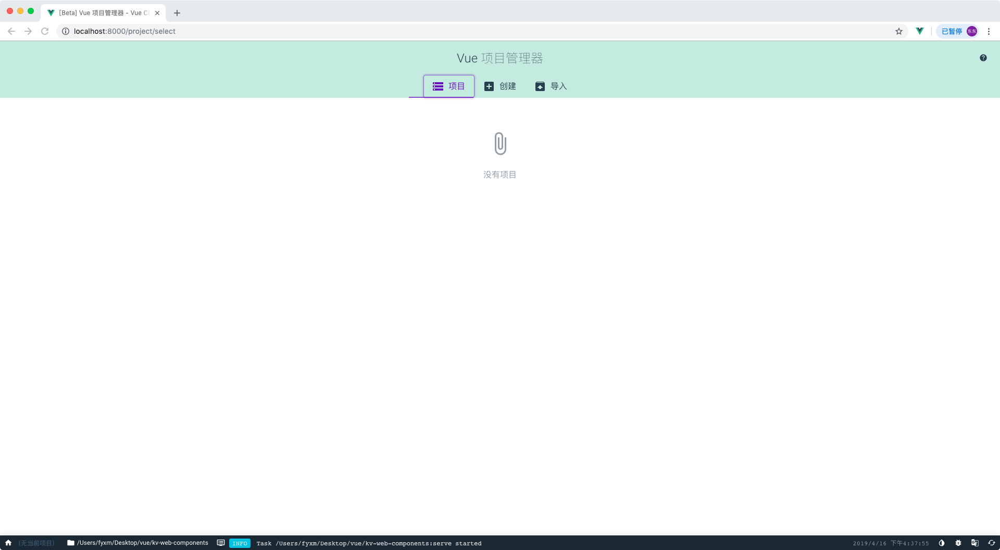

3. 创建项目

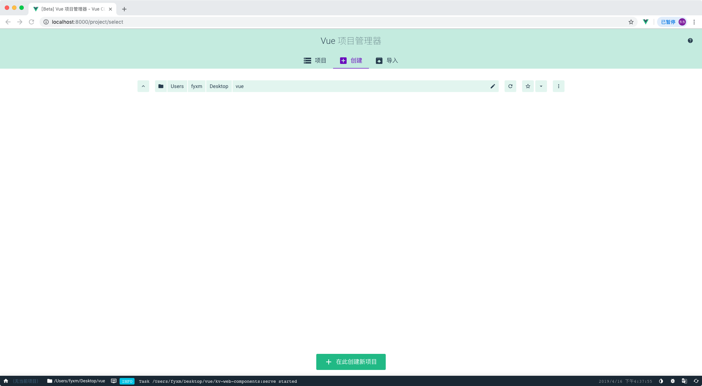

4. 项目配置

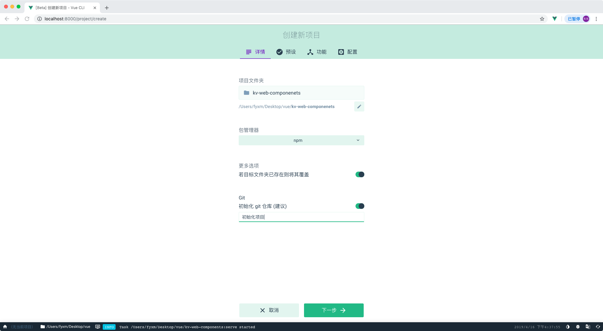

5. 运行环境

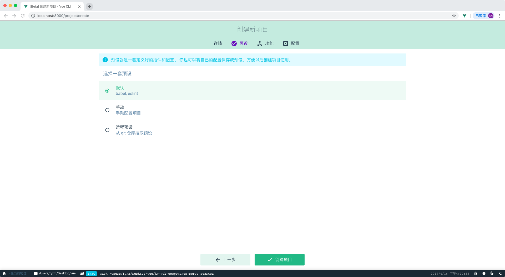

6. 安装依赖

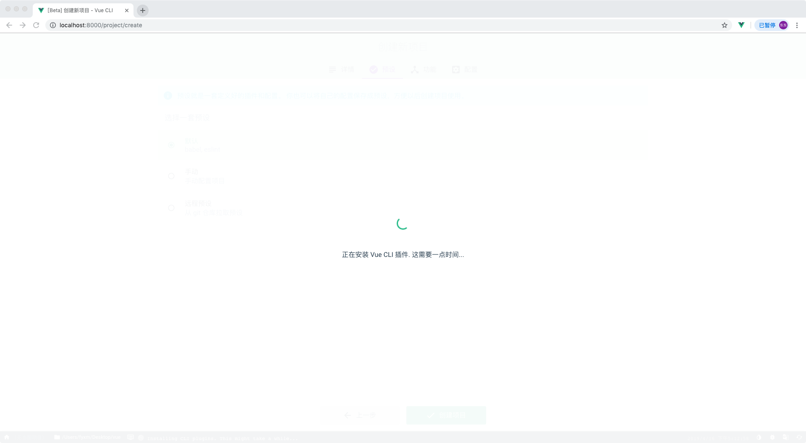

7. 完成安装

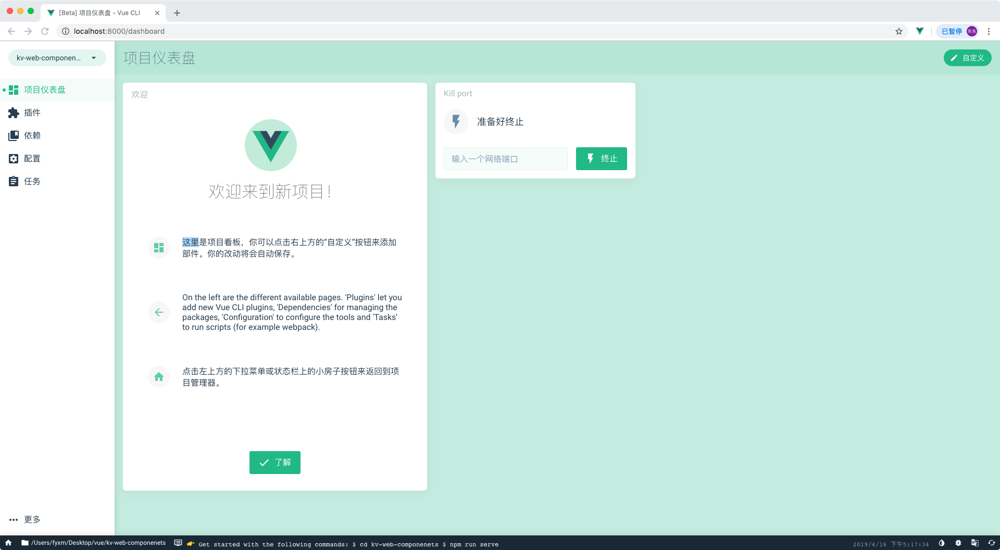

8. 启动项目

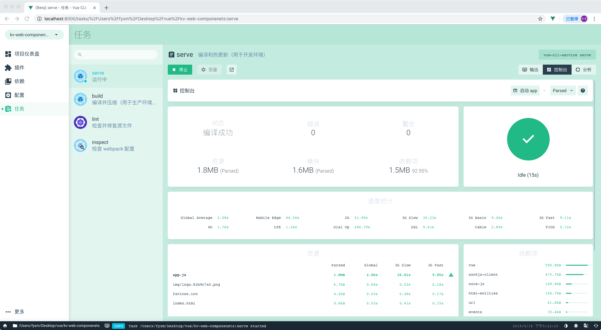

9. 在线访问

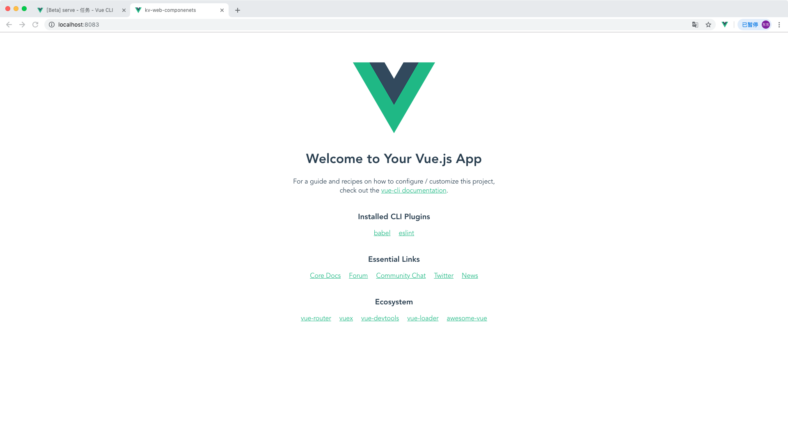

10. 项目根目录创建 `vue.config.js` ，github 部署在线访问需要配置项目路径

```javascript
module.exports = {
  publicPath: "kv-web-components"
};
```

:::

:::snippet Github 创建项目

1. [https://github.com/new](https://github.com/new) 创建项目

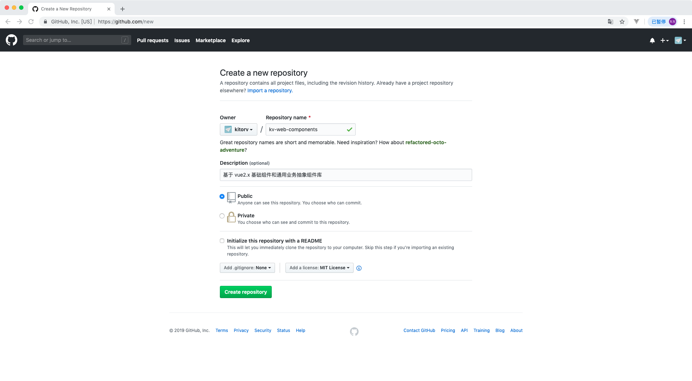

2. 将 vue 项目提交到 github 创建的组件库

3. [https://github.com/settings/tokens](https://github.com/settings/tokens) 生成 token 用于授权你访问

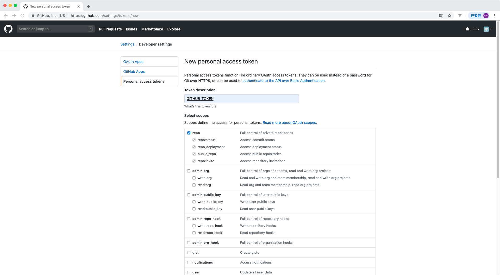

4. 记录 GITHUB_TOKEN 用于自动构建授权访问提交构建后代码

:::

:::snippet NPM 注册授权

1. 注册 npm 账号
2. [https://www.npmjs.com/settings/kitorv/tokens](https://www.npmjs.com/settings/kitorv/tokens) 生成授权码
3. 记录授权码和注册的邮箱用于自动构建发布安装包

:::

:::snippet Travis 自动构建

1. github 账号登陆 [https://www.travis-ci.org/](https://www.travis-ci.org)

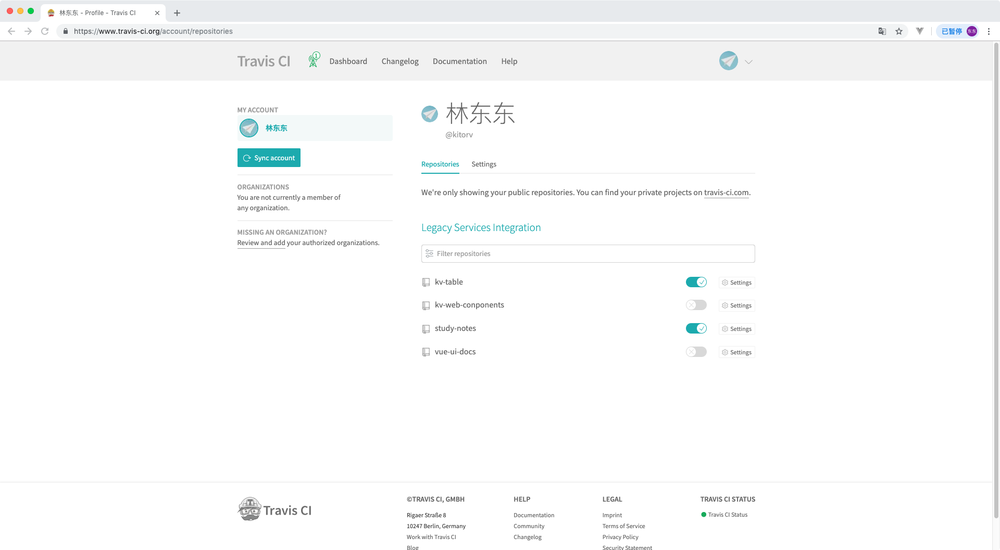

2. 勾选 `kv-web-components` 单击 `Settings` 项目配置

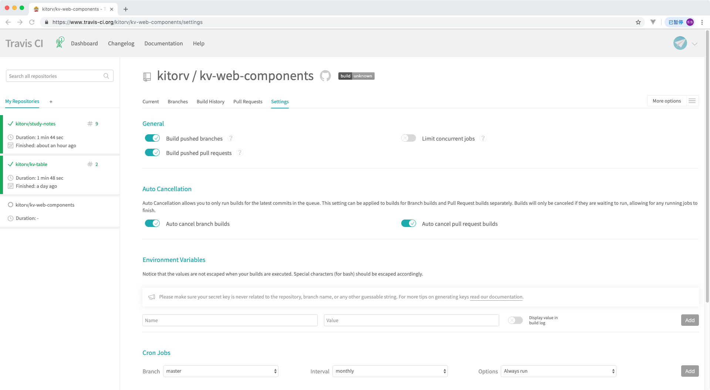

3. 设置环境变量 `Environment Variables`

| 变量         | 描述                    |
| :----------- | :---------------------- |
| GITHUB_TOKEN | Github 生成的授权 Token |
| NPM_EMAIL    | NPM 注册邮箱            |
| NPM_TOKEN    | NPM 授权 Token          |

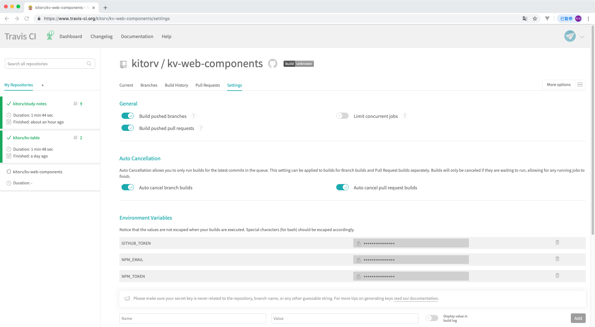

4. `package.json` 去掉 `private` 属性才能发布到 NPM

5. 项目根目录追加 `.travis.yml` 自动化构建的配置文件，详细配置查看[https://docs.travis-ci.com](https://docs.travis-ci.com)

```yml
# 编译环境
language: node_js

# Node 版本
node_js:
  - "10"

# 安装依赖
install:
  - npm install

# 代码编译
script:
  - npm run build

# 发布配置
deploy:
  # 发布到 gh-pages
  - provider: pages
    local_dir: dist
    skip_cleanup: true
    github_token: $GITHUB_TOKEN
    keep_history: true
    on:
      branch: master
  # 发布到 npm
  - provider: npm
    email: $NPM_EMAIL
    api_key: $NPM_TOKEN
    on:
      tags: true
      branch: master
```

6. 提价代码，项目设置标签 `tag` 版本号 `v0.1.0`

7. [https://www.travis-ci.org/kitorv/kv-web-components/](https://www.travis-ci.org/kitorv/kv-web-components/) 查看构建进度

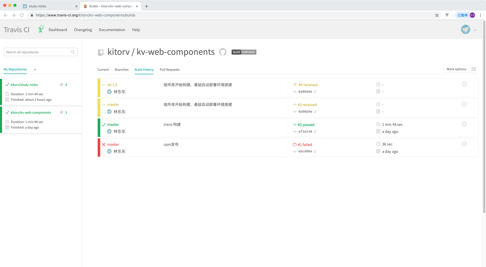

8. 构建完成后查看对应的 `gh-pages` 页面 [https://kitorv.github.io/kv-web-components/](https://kitorv.github.io/kv-web-components/)

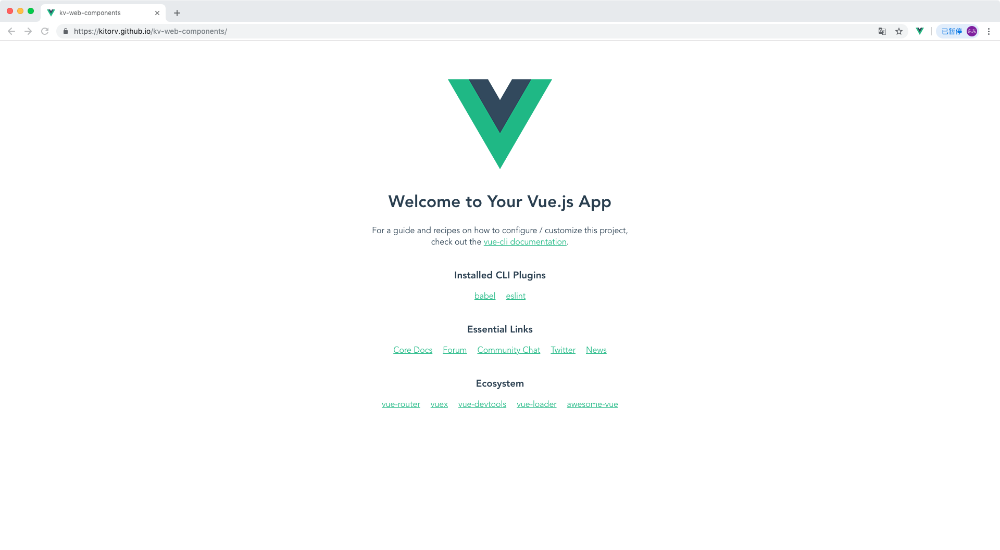

9. npm 搜索 `kv-web-components`

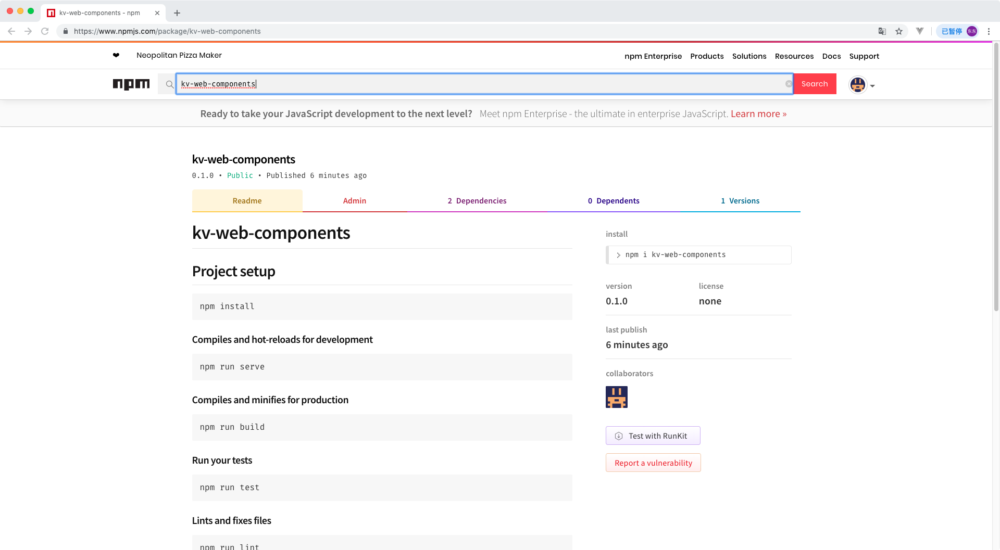

10. 构建在线演示和 npm 发布完成

:::

:::snippet 代码下载

项目地址：[https://github.com/kitorv/kv-web-components](https://github.com/kitorv/kv-web-components)

当前版本：[https://github.com/kitorv/kv-web-components/releases/tag/v0.1.0](https://github.com/kitorv/kv-web-components/releases/tag/v0.1.0)

:::
