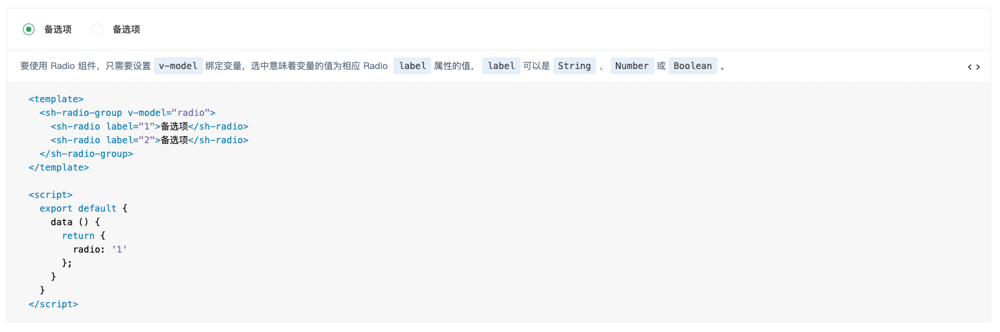
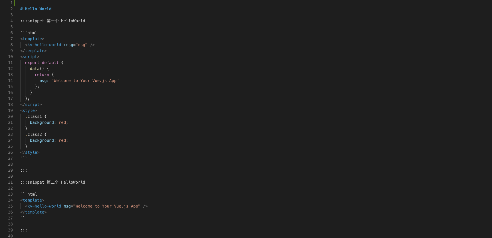
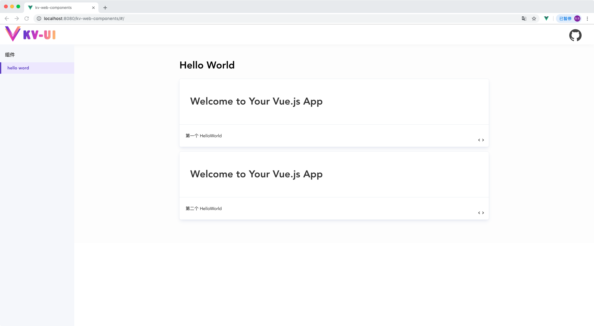

:::snippet 文档示例

1. 代码示例



2. 详细代码


3. markdown 文件



:::

:::snippet demo 示例组件 kv-code-snippet

示例展示：代码运行示例、功能描述、详细代码展示

```html
<template>
  <div class="kv-code-snippet">
    <div class="kv-code-snippet--demo">
      <slot name="source"></slot>
    </div>
    <div class="kv-code-snippet--desc">
      <slot name="desc"></slot>
      <span class="kv-code-snippet--icon-code" @click="showCode = !showCode">
        
        
      </span>
    </div>
    <div v-show="showCode" class="kv-code-snippet--code">
      <slot name="code"></slot>
    </div>
  </div>
</template>

<script>
  export default {
    data() {
      return {
        showCode: false
      };
    }
  };
</script>

<style>
  .kv-code-snippet {
    position: relative;
    box-sizing: border-box;
    width: 100%;
    margin: 0 0 16px;
    border-radius: 5px;
    transition: all 0.2s;
    box-shadow: 0 6px 12px -2px rgba(0, 32, 128, 0.1), 0 0 0 1px #f0f2f7;
    background-color: #ffffff;
    text-align: left;
  }
  .kv-code-snippet--demo {
    box-sizing: border-box;
    padding: 30px 35px;
    color: #333333;
    border-bottom: 1px solid #ebedf0;
  }
  .kv-code-snippet--desc {
    position: relative;
    box-sizing: border-box;
    width: 100%;
    min-height: 44px;
    padding: 12px 50px 12px 20px;
    font-size: 14px;
    transition: background-color 0.4s;
  }

  .kv-code-snippet--icon-code {
    position: absolute;
    right: 16px;
    bottom: 13px;
    cursor: pointer;
    width: 18px;
    height: 18px;
    line-height: 18px;
    text-align: center;
  }

  .kv-code-snippet--icon-code img {
    transition: all 0.4s;
    user-select: none;
    position: absolute;
    left: 0;
    top: 0;
    margin: 0;
    max-width: 100%;
    width: 100%;
    vertical-align: baseline;
    box-shadow: none;
  }

  .kv-code-snippet--code {
    box-sizing: border-box;
    border-top: 1px solid #ebedf0;
  }

  .kv-code-snippet--code code {
    background-color: #f5f7fb;
    font-family: Consolas, Menlo, Courier, monospace;
    border: none;
    display: block;
    font-size: 14px;
    padding: 16px 32px;
    line-height: 1.5;
  }
  .kv-code-snippet--code .hljs {
    padding: 0;
    margin: 0;
  }
</style>
```

> 组件设置设置插槽：source 代码运行效果、desc 内容描述、code 高亮显示代码

:::

:::snippet webpack 加载器 markdown-loader

1. 解析 markdown 为 html 使用 markdown-it 和 markdown-it-container

```bash
npm install markdown-it --save-dev
npm install markdown-it-container --save-dev
```

2. 代码高亮显示使用 highlight.js

```bash
npm install highlight.js --save-dev
```

3. markdown-loader 加载器

```javascript
const MarkdownIt = require("markdown-it");
const MarkdownItContainer = require("markdown-it-container");
const VueTemplateComplier = require("vue-template-compiler");
const hljs = require("highlight.js");
const { parse, compileTemplate } = require("@vue/component-compiler-utils");

module.exports = function(source) {
  // 需要解析成vue代码块集合
  const componentCodeList = [];
  let styleCodeList = [];
  // 初始还MarkdownIt用于转换md文件为html
  const markdownIt = MarkdownIt({
    // 将markdown中的代码块用hljs高亮显示
    highlight: function(str, lang) {
      if (lang && hljs.getLanguage(lang)) {
        return `<pre class="hljs"><code>${
          hljs.highlight(lang, str, true).value
        }</code></pre>`;
      }
      return `<pre class="hljs"><code>${markdownIt.utils.escapeHtml(
        str
      )}</code></pre>`;
    }
  });
  // 使用【markdown-it-container】插件解析【:::snippet :::】代码块为vue渲染
  markdownIt.use(MarkdownItContainer, "snippet", {
    // 验证代码块为【:::snippet :::】才进行渲染
    validate(params) {
      return params.trim().match(/^snippet\s*(.*)$/);
    },
    // 代码块渲染
    render(tokens, index) {
      const token = tokens[index];
      const tokenInfo = token.info.trim().match(/^snippet\s*(.*)$/);
      if (token.nesting === 1) {
        // 获取snippet第一行的表述内容
        const desc = tokenInfo && tokenInfo.length > 1 ? tokenInfo[1] : "";
        // 获取vue组件示例的代码
        const nextIndex = tokens[index + 1];
        const content = nextIndex.type === "fence" ? nextIndex.content : "";
        // 将content解析为vue组件基本属性对象;
        let { template, script, styles } = parse({
          source: content,
          compiler: VueTemplateComplier,
          needMap: false
        });
        styleCodeList = styleCodeList.concat(styles);
        // 将template的转为render函数
        const { code } = compileTemplate({
          source: template.content,
          compiler: VueTemplateComplier
        });
        // 获取script的代码
        script = script ? script.content : "";
        if (script) {
          script = script.replace(
            /export\s+default/,
            "const exportJavaScript ="
          );
        } else {
          script = "const exportJavaScript = {} ;";
        }
        // 代码块解析将需要解析vue组件的存储，渲染html用组件名称替代
        const name = `kv-snippent-${componentCodeList.length}`;
        // 渲染组件代码添加到数据集合
        componentCodeList.push(`"${name}":(function () {
          ${code}
          ${script}
           return {
             ...exportJavaScript,
             render,
             staticRenderFns
          }
        })()`);
        // 将需要渲染的示例用kv-code-snippet组件包裹替换插槽显示示例效果
        return `<kv-code-snippet>
                  <div slot="desc">${markdownIt.render(desc)}</div>
                  <${name} slot="source" />
                  <div slot="code">`;
      }
      return `    </div>
                </kv-code-snippet> `;
    }
  });
  // 将所有转换好的代码字符串拼接成vue单组件template、script、style格式
  return `
        <template>
          <div class="kv-snippet-doc">
            ${markdownIt.render(source)}
          </div>
        </template>
        <script>
           export default {
           name: 'kv-component-doc',
           components: {
            ${componentCodeList.join(",")}
           }
         }
       </script>
       <style>
         ${Array.from(styleCodeList, m => m.content).join("\n")}
       </style>`;
};
```

4. 加载器编译过程

（1）markdown-it 来解析 markdown 内容

（2）markdown-it-container 解析自定义`:::snippet :::`为 vue 组件代码

（3）`:::snippet :::`代码块中的 html 代码编译为 vue 可执行代码字符串

（4）@vue/component-compiler-utils 将 template 模板编译成 render 函数

（5）所有的代码块`:::snippet :::`都编译拼接对应的单个组件自执行函数返回 vue component

（6）markdown 文件直接编译的 html 作为新的 vue 组件 template

（7）将 vue component 的组件集合拼接到 vue 组件 script 标签中的 compoenent

（8）将各个组件的 style 拼接到 vue 组件的 style

（9）template、script、style 组合成单组件格式的字符串，在配置 vue-loader 来加载解析

5. vue.config.js 加载器配置解析

```javascript
module.exports = {
  publicPath: "kv-web-components",
  chainWebpack: config => {
    config.module
      .rule("md")
      .test(/\.md/)
      .use("vue-loader")
      .loader("vue-loader")
      .end()
      .use("markdown-loader")
      .loader(
        require("path").resolve(__dirname, "./webpack/markdown-loader.js")
      )
      .end();
  }
};
```

:::

:::snippet 示例配置

1. 修改 HeloWorld.vue 组件便于测试

```html
<template>
  <div class="hello">
    <h1>{{ msg }}</h1>
  </div>
</template>

<script>
  export default {
    name: "HelloWorld",
    props: {
      msg: String
    }
  };
</script>
```

2. 代码示例文档 HeloWorldDoc.md


3. main.js 全局注册和样式引用

```javascript
import Vue from "vue";
import App from "./App.vue";
import KvCodeSnippet from "./components/code-snippet";
import KvHelloWorld from "./components/HelloWorld";
import "highlight.js/styles/color-brewer.css";

Vue.config.productionTip = false;
Vue.component("kv-code-snippet", KvCodeSnippet);
Vue.component("kv-hello-world", KvHelloWorld);

new Vue({
  render: h => h(App)
}).$mount("#app");
```

4. app.vue 引用 HeloWorldDoc.md

```html
<template>
  <div id="app">
    
    <kv-hello-world-doc></kv-hello-world-doc>
  </div>
</template>

<script>
  import KvHelloWorld from "./components/HelloWorld";
  import KvHelloWorldDoc from "./components/HelloWorldDoc.md";

  export default {
    name: "app",
    components: {
      KvHelloWorld,
      KvHelloWorldDoc
    }
  };
</script>

<style>
  #app {
    font-family: "Avenir", Helvetica, Arial, sans-serif;
    -webkit-font-smoothing: antialiased;
    -moz-osx-font-smoothing: grayscale;
    text-align: center;
    color: #2c3e50;
    margin-top: 60px;
    padding: 0 150px;
  }
</style>
```

5. 启动项目或者重新运行


:::

:::snippet 路由切换组件文档

1. 安装路由

```bash
npm install vue-router -save-dev
```

2. 样式处理可以使用`less`、`scss`、`stylus`等动态处理，当前使用 scss 动态处理 css

```bash
npm install node-sass -save-dev
npm install sass-loader -save-dev
```

3. 组件首页 component.vue

```html
<template>
  <div class="k-v-compoent">
    <!-- top -->
    <div class="k-v-compoent--top">
      <div class="k-v-compoent--logo">
        
      </div>
      <a
        class="k-v-component--github"
        href="https://github.com/kitorv/kv-web-components"
      >
        <i class="k-v-icon-github"></i>
      </a>
    </div>
    <!-- content -->
    <div class="k-v-conpoenent--content">
      <div class="k-v-conpoenent--left">
        <h3 class="k-v-conpoenent--group">组件</h3>
        <router-link class="k-v-conpoenent--link" to="/"
          >hello word</router-link
        >
      </div>
      <div class="k-v-conpoenent--page">
        <div class="k-v-conpoenent--view">
          <router-view></router-view>
        </div>
      </div>
    </div>
  </div>
</template>

<script>
  export default {};
</script>

<style lang="scss">
  .k-v-compoent {
    position: relative;
  }

  .k-v-compoent--top {
    position: fixed;
    left: 0;
    top: 0;
    z-index: 20;
    height: 65px;
    width: 100%;
    padding: 6px 16px;
    background-color: #fff;
    box-sizing: border-box;
    transition: all 0.3s ease;
    box-shadow: 0 0 15px 0 rgba(0, 0, 0, 0.04);
  }

  .k-v-compoent--logo {
    vertical-align: middle;
    height: 65px;
    line-height: 65px;
    display: inline-block;
    padding-right: 15px;

    > img {
      height: 50px;
    }
  }

  .k-v-component--github {
    color: #444444;
    font-size: 40px;
    position: fixed;
    right: 40px;
    top: 10px;
    text-decoration: none;
    cursor: pointer;
    transition: all 0.3s;

    &:hover {
      transform: scale(1.2);
    }
  }

  .k-v-conpoenent--content {
    padding-top: 65px;
  }

  .k-v-conpoenent--left {
    position: fixed;
    z-index: 30;
    margin: 0;
    top: 65px;
    left: 0;
    bottom: 0;
    box-sizing: border-box;
    overflow-y: auto;
    width: 240px;
    font-size: 14px;
    background-color: #f5f7fb;
    margin: 0;
    padding: 14px 0;
  }

  .k-v-conpoenent--group {
    color: #333333;
    font-size: 16px;
    padding-left: 16px;
    margin-top: 0;
    margin-bottom: 4px;
    box-sizing: border-box;
    height: 40px;
    line-height: 40px;
    font-weight: bold;
  }

  .k-v-conpoenent--link {
    position: relative;
    display: inline-block;
    color: #444444;
    border-left: 4px solid transparent;
    padding: 8px 16px 8px 20px;
    line-height: 1.5;
    width: 100%;
    box-sizing: border-box;
    transition: all 0.3s ease;
    font-size: 14px;
    text-decoration: none;

    &:hover {
      color: #5b3cc4;
    }
  }

  .router-link-exact-active {
    font-weight: 600;
    border-left-color: #5b3cc4;
    color: #5b3cc4;
    font-weight: bold;
    background-color: #ede8ff;
    opacity: 1;
  }

  .k-v-conpoenent--page {
    padding-left: 240px;
    background-color: #fdfdfd;
  }

  .k-v-conpoenent--view {
    max-width: 1000px;
    padding: 25px 50px 60px 50px;
    margin: 0 auto;
  }
</style>
```

4. 路由配置

```javascript
import Vue from "vue";
import Router from "vue-router";

Vue.use(Router);

export default new Router({
  routes: [
    {
      path: "/",
      component: () => import("./views/component.vue"),
      children: [
        {
          path: "/",
          name: "hello",
          component: () => import("./components/HelloWorldDoc.md")
        }
      ]
    }
  ]
});
```

5. 效果展示



:::

:::snippet 代码下载

项目地址：[https://github.com/kitorv/kv-web-components](https://github.com/kitorv/kv-web-components)

当前版本：[https://github.com/kitorv/kv-web-components/releases/tag/v0.1.2](https://github.com/kitorv/kv-web-components/releases/tag/v0.1.2)

:::
