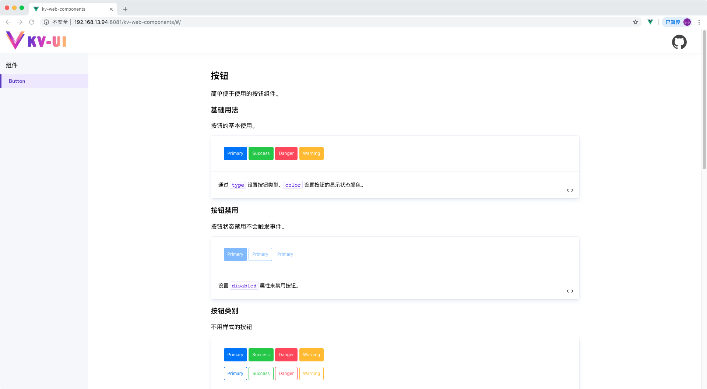
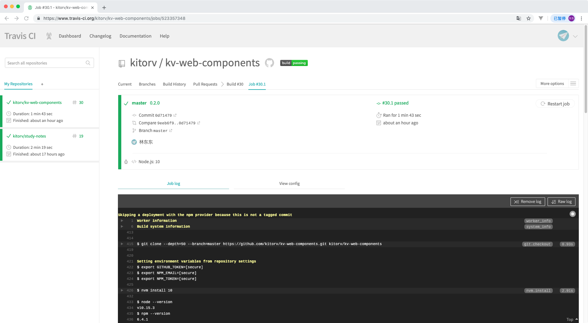
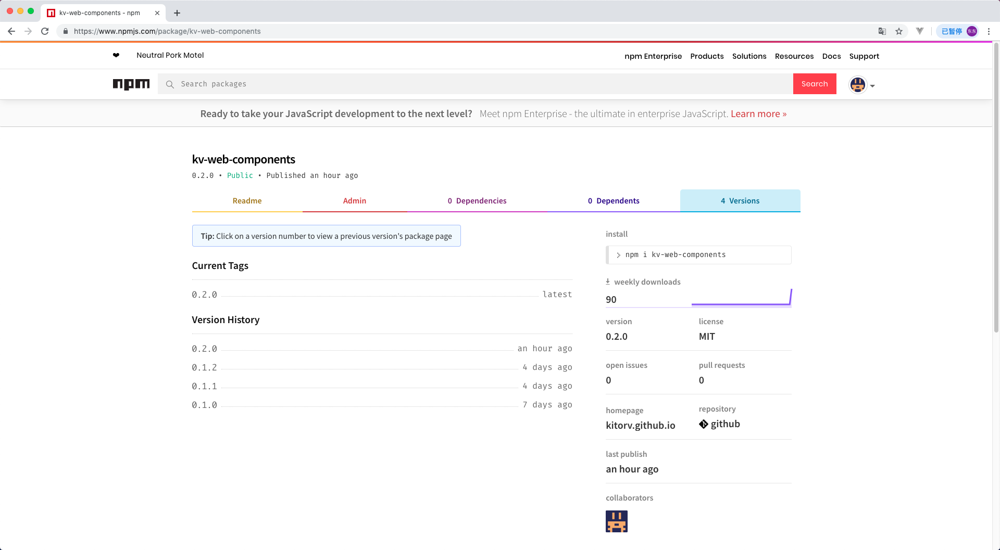

:::snippet KvButton 按钮组件

1. `v-bind="$attrs"` 将原生的 `button` 属性绑定在 `KvButton` 直接设置到 `button` 标签上。
2. `kv-button--type-${property}`根据不同的属性绑定 `class` 生成不同的样式。
3. `$slots.default` 判断是否设置了默认的 `slot` 插槽来根据内容设置对应的样式。
4. 通过 `icon` 和 `iconType` 来设置图标和放置位置。

```html
<template>
  <button
    v-bind="$attrs"
    :class="[
          'kv-button',
          `kv-button--type-${type}`,
          `kv-button--color-${color}`,
          `kv-button--size-${size}`,
          {'kv-button--circle':circle},
          iconTypeClass]"
  >
    <i v-if="icon&&iconType==='left'" :class="icon"></i>
    <span v-if="$slots.default" class="kv-button--text">
      <slot />
    </span>
    <i v-if="icon&&iconType==='right'" :class="icon"></i>
  </button>
</template>

<script>
  export default {
    name: "KvButton",
    componentName: "KvButton",
    props: {
      type: {
        type: String,
        default: "fill"
      },
      color: {
        type: String,
        default: "primary"
      },
      icon: String,
      iconType: {
        type: String,
        default: "left"
      },
      circle: Boolean,
      size: {
        type: String,
        default: "default"
      }
    },
    computed: {
      iconTypeClass() {
        if (!this.$slots.default) return `kv-button--icon-default`;
        return `kv-button--icon-${this.iconType}`;
      }
    }
  };
</script>
<style lang="scss" scoped>
  .kv-button {
    transition: all 0.2s ease;
    padding: 10px;
    border: 0;
    border-radius: 4px;
    cursor: pointer;
    position: relative;
    overflow: hidden;
    color: #ffffff;
    box-sizing: border-box;
    background: transparent;
    outline: none;

    &:disabled {
      opacity: 0.5;
      cursor: default;
      pointer-events: none;
    }
  }

  .kv-button--text {
    position: relative;
    height: 16px;
    display: inline-block;
    transition: all 0.3s ease;
  }

  .kv-button--type-fill {
    &.kv-button--color-primary {
      background-color: #2e74ff;
      &:hover {
        box-shadow: 0px 9px 20px -9px #2e74ff;
      }
    }
    &.kv-button--color-success {
      background-color: #46c83a;
      &:hover {
        box-shadow: 0px 9px 20px -9px #46c83a;
      }
    }
    &.kv-button--color-danger {
      background-color: #f54757;
      &:hover {
        box-shadow: 0px 9px 20px -9px #f54757;
      }
    }
    &.kv-button--color-warning {
      background-color: #f9ba03;
      &:hover {
        box-shadow: 0px 9px 20px -9px #f9ba03;
      }
    }
  }

  .kv-button--type-border {
    padding: 9px;

    &.kv-button--color-primary {
      border: 1px solid #2e74ff;
      color: #2e74ff;

      &:hover {
        background-color: #2e74ff1a;
      }
    }
    &.kv-button--color-success {
      border: 1px solid #46c83a;
      color: #46c83a;

      &:hover {
        background-color: #46c83a1a;
      }
    }
    &.kv-button--color-danger {
      border: 1px solid #f54757;
      color: #f54757;

      &:hover {
        background-color: #f547571a;
      }
    }
    &.kv-button--color-warning {
      border: 1px solid #f9ba03;
      color: #f9ba03;

      &:hover {
        background-color: #f9ba031a;
      }
    }
  }

  .kv-button--type-flat {
    &.kv-button--color-primary {
      color: #2e74ff;

      &:hover {
        background-color: #2e74ff1a;
      }
    }
    &.kv-button--color-success {
      color: #46c83a;

      &:hover {
        background-color: #46c83a1a;
      }
    }
    &.kv-button--color-danger {
      color: #f54757;

      &:hover {
        background-color: #f547571a;
      }
    }
    &.kv-button--color-warning {
      color: #f9ba03;

      &:hover {
        background-color: #f9ba031a;
      }
    }
  }

  .kv-button--icon-default {
    width: 36px;
    height: 36px;
  }

  .kv-button--icon-left > i {
    margin-right: 5px;
  }

  .kv-button--icon-right > i {
    margin-left: 5px;
  }

  .kv-button--circle {
    border-radius: 18px;
  }

  .kv-button--size-large {
    font-size: 16px;
    padding: 13px;

    &.kv-button--circl {
      border-radius: 22px;
    }
  }

  .kv-button--size-small {
    padding: 6px 8px;
    &.kv-button--circl {
      border-radius: 14px;
    }
  }
</style>
```

:::

:::snippet KvButton 安装配置

1. Vue 安装配置 `components/button/index.js`

```javascript
import KvButton from "./button.vue";
KvButton.install = function(Vue) {
  Vue.component(KvButton.name, KvButton);
};
export default KvButton;
```

2. 组件库的安装配置 `packages/index.js`

```javascript
import KvButton from "./components/button";
const components = [KvButton];
const install = function(Vue) {
  components.forEach(component => {
    Vue.component(component.name, component);
  });
};
export default {
  version: process.env.VERSION,
  install,
  KvButton
};
```

3. 引用安装 `main.js`

```javascript
import KvWebComponents from "../packages/index.js";
Vue.use(KvWebComponents);
```

4. 编写 md 文档文件 [components/button/index.md](https://raw.githubusercontent.com/kitorv/kv-web-components/master/packages/components/button/index.md)

5. 路由配置 `router.js`

```javascript
import Vue from "vue";
import Router from "vue-router";
Vue.use(Router);
export default new Router({
  routes: [
    {
      path: "/",
      component: () => import("./views/component.vue"),
      children: [
        {
          path: "/",
          name: "component-button",
          component: () => import("../packages/components/button/index.md")
        }
      ]
    }
  ]
});
```

6. 页面链接配置 `views/component.vue`

```html
<router-link class="k-v-conpoenent--link" to="/">Button</router-link>
```

7. 效果查看 [https://kitorv.github.io/kv-web-components/#/button](https://kitorv.github.io/kv-web-components/#/button)



:::

:::snippet NPM 发布配置

1. Vue 打包类库配置,参照 Vue CLI[构建目标](https://cli.vuejs.org/zh/guide/build-targets.html#构建目标)进行类库构建配置入口文件`src/index.js`

```javascript
import KvWebComponents from "../packages/index.js";
import "../packages/index.scss";
export default KvWebComponents;
```

2. npm 的 scripts 增加配置

```javascript
"lib": "vue-cli-service build --dest lib --target lib src/index.js"
```

4. `.travis.yml`配置调整,设置 `npm run lib` 编译完成，`skip_cleanup: true` 直接发布到 NPM 不清空目录

```yml
# 编译环境
language: node_js

# Node 版本
node_js:
  - "10"

# 安装依赖
install:
  - npm install

# 代码编译
script:
  - npm run build
  - npm run lib

# 发布配置
deploy:
  # 发布到 gh-pages
  - provider: pages
    local_dir: dist
    skip_cleanup: true
    github_token: $GITHUB_TOKEN
    keep_history: true
    on:
      branch: master
  # 发布到 npm
  - provider: npm
    email: $NPM_EMAIL
    api_key: $NPM_TOKEN
    skip_cleanup: true
    on:
      tags: true
      branch: master
```

5. 提交代码设置标签 tag 推送到 github 触发 Travis CI 自动构建



6. NPM 查看,发布成功



:::

:::snippet 安装测试

1. 安装

```bash
npm i kv-web-components -S
```

2. 引用

```javascript
import Vue from "vue";
import KvWebComponents from "kv-web-components";
import "kv-web-components/lib/kv-web-components.css";
Vue.use(KvWebComponents);
```

3. 测试

```html
<kv-button>button</kv-button>
```

:::

:::snippet KvGrid 栅格布局

1. 栅格布局拆分 KvRow、KvCol 组件来进行布局排版
2. KvRow 根据属性设置样式主要设置 flex 布局和对应的相关属性提取为 props
3. KvCol 获取父组件 gutter 来设置当前组建的间隔和属性生成 class 和 style
4. KvCol 循环生成 24 栅格样式

```scss
@for $i from 0 through 24 {
  .kv-col-#{$i} {
    width: (1 / 24 * $i * 100) * 1%;
  }
  .kv-col-offset-#{$i} {
    margin-left: (1 / 24 * $i * 100) * 1%;
  }
  .kv-col-pull-#{$i} {
    position: relative;
    right: (1 / 24 * $i * 100) * 1%;
  }
  .kv-col-push-#{$i} {
    position: relative;
    left: (1 / 24 * $i * 100) * 1%;
  }
}
```

5. KvCol 根据不同的分辨率生成 24 栅格样式

```scss
@media only screen and (max-width: 768px) {
  @for $i from 0 through 24 {
    .kv-col-xs-#{$i} {
      width: (1 / 24 * $i * 100) * 1%;
    }
    .kv-col-offset-xs-#{$i} {
      margin-left: (1 / 24 * $i * 100) * 1%;
    }
    .kv-col-pull-xs-#{$i} {
      position: relative;
      right: (1 / 24 * $i * 100) * 1%;
    }
    .kv-col-push-xs-#{$i} {
      position: relative;
      left: (1 / 24 * $i * 100) * 1%;
    }
  }
}
```

6. KvRow

```html
<script>
  export default {
    name: "KvRow",
    componentName: "KvRow",
    props: {
      tag: { type: String, default: "div" },
      gutter: Number,
      type: String,
      justify: { type: String, default: "start" },
      align: { type: String, default: "top" }
    },
    computed: {
      style() {
        const css = {};
        if (this.gutter) {
          css.marginLeft = `-${this.gutter / 2}px`;
          css.marginRight = css.marginLeft;
        }
        return css;
      }
    },
    render(h) {
      return h(
        this.tag,
        {
          class: [
            "kv-row",
            this.justify !== "start" ? `kv-row--justify-${this.justify}` : "",
            this.align !== "top" ? `kv-row--align-${this.align}` : "",
            { "kv-row--flex": this.type === "flex" }
          ],
          style: this.style
        },
        this.$slots.default
      );
    }
  };
</script>
<style lang="scss" scoped>
  .kv-row {
    position: relative;
    box-sizing: border-box;

    &::before,
    &::after {
      display: table;
      content: "";
    }

    &::after {
      clear: both;
    }
  }

  .kv-row--flex {
    display: flex;

    &:before,
    &:after {
      display: none;
    }
  }

  .kv-row--justify-start {
    justify-content: flex-start;
  }

  .kv-row--justify-center {
    justify-content: center;
  }

  .kv-row--justify-end {
    justify-content: flex-end;
  }

  .kv-row--justify-end {
    justify-content: flex-end;
  }

  .kv-row--justify-space-between {
    justify-content: space-between;
  }

  .kv-row--justify-space-around {
    justify-content: space-around;
  }

  .kv-row--align-top {
    align-items: flex-start;
  }

  .kv-row--align-middle {
    align-items: center;
  }

  .kv-row--align-bottom {
    align-items: flex-end;
  }
</style>
```

7. KvCol

```html
<script>
  export default {
    name: "KvCol",
    props: {
      span: { type: Number, default: 24 },
      tag: { type: String, default: "div" },
      offset: Number,
      pull: Number,
      push: Number,
      xs: [Number, Object],
      sm: [Number, Object],
      md: [Number, Object],
      lg: [Number, Object],
      xl: [Number, Object]
    },
    computed: {
      gutter() {
        let parent = this.$parent;
        while (parent && parent.$options.componentName !== "KvRow") {
          parent = parent.$parent;
        }
        return parent ? parent.gutter : 0;
      }
    },
    render(h) {
      let classList = [];
      let style = {};
      if (this.gutter) {
        style.paddingLeft = this.gutter / 2 + "px";
        style.paddingRight = style.paddingLeft;
      }
      ["span", "offset", "pull", "push"].forEach(prop => {
        if (this[prop] || this[prop] === 0) {
          classList.push(
            prop !== "span"
              ? `kv-col-${prop}-${this[prop]}`
              : `kv-col-${this[prop]}`
          );
        }
      });
      ["xs", "sm", "md", "lg", "xl"].forEach(size => {
        if (typeof this[size] === "number") {
          classList.push(`kv-col-${size}-${this[size]}`);
          return;
        }
        if (typeof this[size] === "object") {
          let props = this[size];
          Object.keys(props).forEach(prop => {
            classList.push(
              prop !== "span"
                ? `kv-col-${size}-${prop}-${props[prop]}`
                : `kv-col-${size}-${props[prop]}`
            );
          });
        }
      });
      return h(
        this.tag,
        {
          class: ["kv-col", classList],
          style
        },
        this.$slots.default
      );
    }
  };
</script>
<style lang="scss" scoped>
  [class*="kv-col-"] {
    float: left;
    box-sizing: border-box;
  }

  .kv-col-0 {
    display: none;
  }

  @for $i from 0 through 24 {
    .kv-col-#{$i} {
      width: (1 / 24 * $i * 100) * 1%;
    }

    .kv-col-offset-#{$i} {
      margin-left: (1 / 24 * $i * 100) * 1%;
    }

    .kv-col-pull-#{$i} {
      position: relative;
      right: (1 / 24 * $i * 100) * 1%;
    }

    .kv-col-push-#{$i} {
      position: relative;
      left: (1 / 24 * $i * 100) * 1%;
    }
  }

  @media only screen and (max-width: 768px) {
    @for $i from 0 through 24 {
      .kv-col-xs-#{$i} {
        width: (1 / 24 * $i * 100) * 1%;
      }

      .kv-col-offset-xs-#{$i} {
        margin-left: (1 / 24 * $i * 100) * 1%;
      }

      .kv-col-pull-xs-#{$i} {
        position: relative;
        right: (1 / 24 * $i * 100) * 1%;
      }

      .kv-col-push-xs-#{$i} {
        position: relative;
        left: (1 / 24 * $i * 100) * 1%;
      }
    }
  }

  @media only screen and (min-width: 768px) {
    @for $i from 0 through 24 {
      .kv-col-sm-#{$i} {
        width: (1 / 24 * $i * 100) * 1%;
      }

      .kv-col-offset-sm-#{$i} {
        margin-left: (1 / 24 * $i * 100) * 1%;
      }

      .kv-col-pull-sm-#{$i} {
        position: relative;
        right: (1 / 24 * $i * 100) * 1%;
      }

      .kv-col-push-sm-#{$i} {
        position: relative;
        left: (1 / 24 * $i * 100) * 1%;
      }
    }
  }

  @media only screen and (min-width: 992px) {
    @for $i from 0 through 24 {
      .kv-col-md-#{$i} {
        width: (1 / 24 * $i * 100) * 1%;
      }

      .kv-col-offset-md-#{$i} {
        margin-left: (1 / 24 * $i * 100) * 1%;
      }

      .kv-col-pull-md-#{$i} {
        position: relative;
        right: (1 / 24 * $i * 100) * 1%;
      }

      .kv-col-push-md-#{$i} {
        position: relative;
        left: (1 / 24 * $i * 100) * 1%;
      }
    }
  }

  @media only screen and (min-width: 1200px) {
    @for $i from 0 through 24 {
      .kv-col-lg-#{$i} {
        width: (1 / 24 * $i * 100) * 1%;
      }

      .kv-col-offset-lg-#{$i} {
        margin-left: (1 / 24 * $i * 100) * 1%;
      }

      .kv-col-pull-lg-#{$i} {
        position: relative;
        right: (1 / 24 * $i * 100) * 1%;
      }

      .kv-col-push-lg-#{$i} {
        position: relative;
        left: (1 / 24 * $i * 100) * 1%;
      }
    }
  }

  @media only screen and (min-width: 1920px) {
    @for $i from 0 through 24 {
      .kv-col-xl-#{$i} {
        width: (1 / 24 * $i * 100) * 1%;
      }

      .kv-col-offset-xl-#{$i} {
        margin-left: (1 / 24 * $i * 100) * 1%;
      }

      .kv-col-pull-xl-#{$i} {
        position: relative;
        right: (1 / 24 * $i * 100) * 1%;
      }

      .kv-col-push-xl-#{$i} {
        position: relative;
        left: (1 / 24 * $i * 100) * 1%;
      }
    }
  }
</style>
```

8. 效果查看 [https://kitorv.github.io/kv-web-components/#/grid](https://kitorv.github.io/kv-web-components/#/grid)

:::

:::snippet 代码下载

项目地址：[https://github.com/kitorv/kv-web-components](https://github.com/kitorv/kv-web-components)

当前版本：[https://github.com/kitorv/kv-web-components/releases/tag/v0.2.0](https://github.com/kitorv/kv-web-components/releases/tag/v0.2.0)

:::
