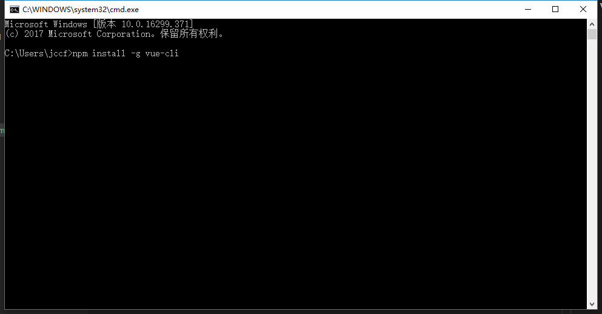
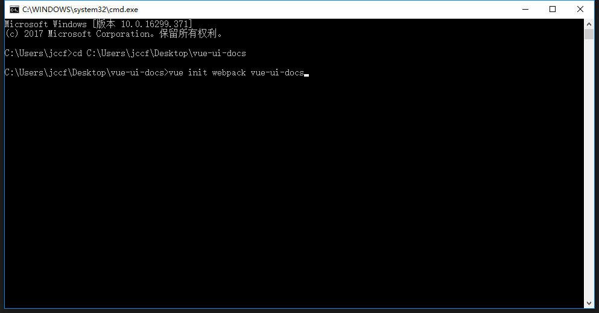
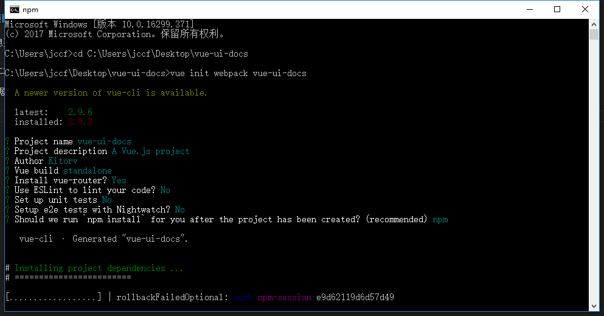
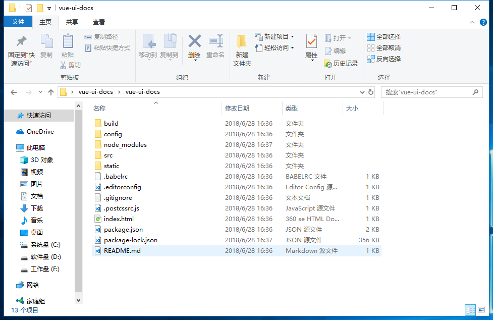
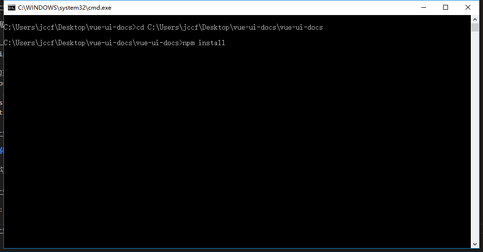
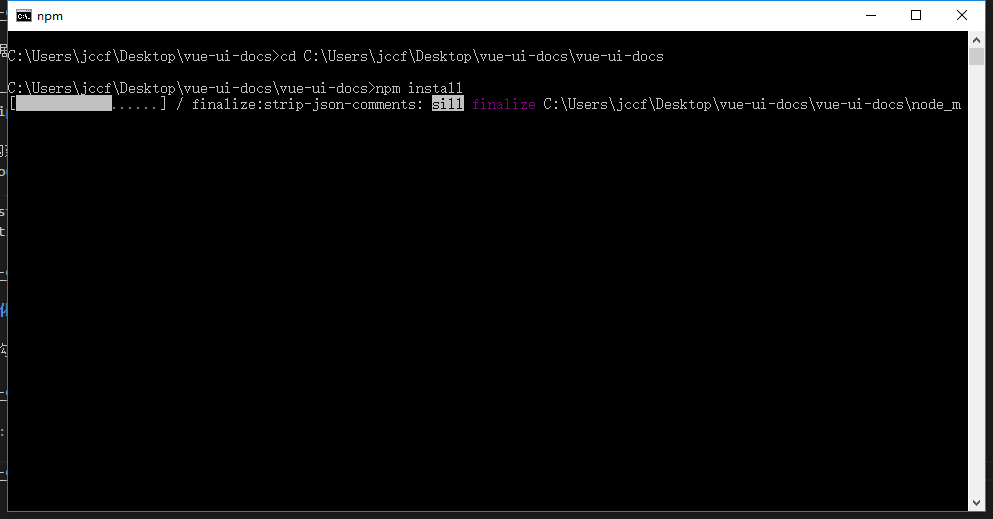
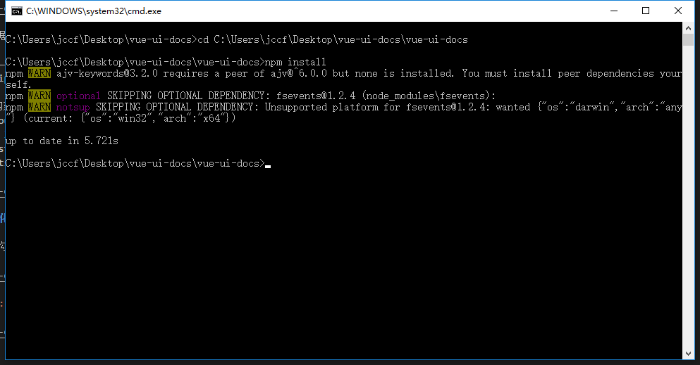
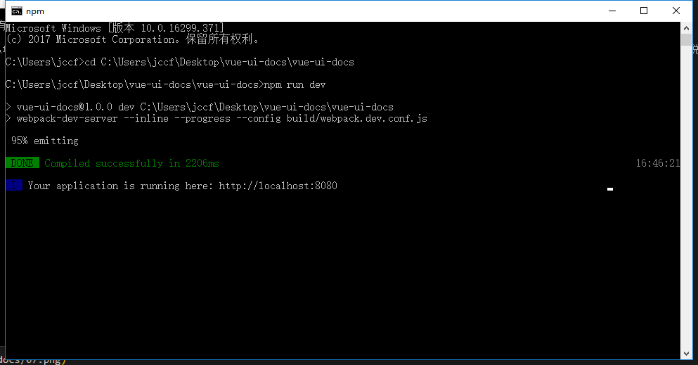
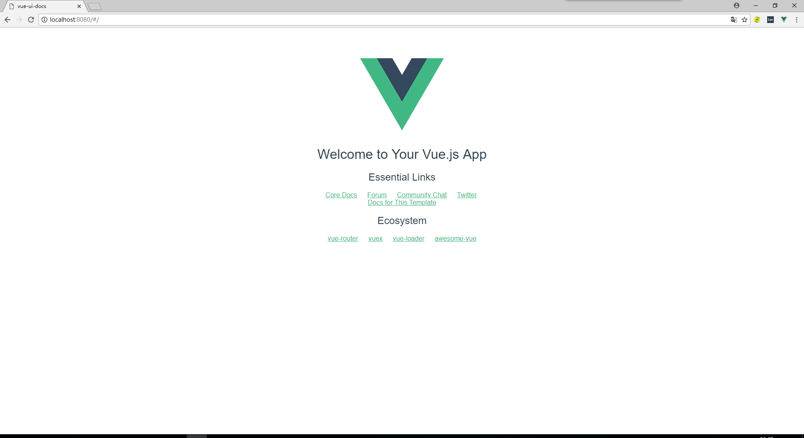

# 从 Vue-cli 开始构建 UI 库到 Markdown 生成文档和演示案例

## 1. vue-cli 环境搭建

- 打开`cmd`命令工具，输入`npm install -g vue-cli`全局安装 vue-cli

- 安装过程慢，切换到淘宝镜像源`npm config set registry https://registry.npm.taobao.org`

## 2. 构建 vue-cli 项目

- 打开`cmd`，进入想要创建项目的目录下，输入：`vue init webpack vue-ui-docs`,回车

- 等待初始化完成根据控制台输入命令完成接下去的操作

  - Project name:——项目名称
  - Project description:——项目描述
  - Author:——作者
  - Vue build:——构建模式，一般默认选择第一种
  - Install vue-router?:——是否安装引入 vue-router，这里选是，vue-router 是路由组件,后面构建项目会用到
  - Use ESLint to lint your code?:——这里强烈建议选 no 否则你会非常痛苦，eslint 的格式验证非常严格，多一个空格少一个空格都会报错，所以对于新手来说，一般不建议开启，会加大开发难度
  - Setup unit tests with Karma + Mocha ：——测试可以不安装
  - Setup e2e tests with Nightwatch ：——测试可以不安装

## 3. 构建完成初始化项目依赖

- 初始化完成目录结构

- 切换到目录 `cd C:\Users\jccf\Desktop\vue-ui-docs`,执行命令`npm install`

- 开始安装依赖环境

- 依赖环境安装完成

## 4. 启动项目

- 打开`cmd`，进入到项目所在目录下，输入`npm run dev`,回车，启动项目

- 打开浏览器输入`http://localhost:8080`访问

